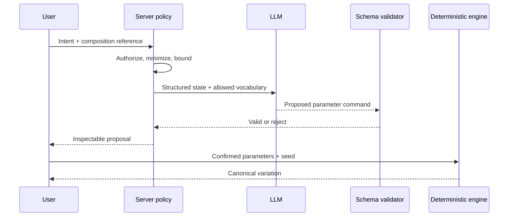

# AI system design

## Boundary

AI is an interpreter and explainer, not the music engine. It may map “darker and less busy” to a bounded proposal, explain current harmony, suggest an action, or render a structured synth recipe in user-friendly language. It does not directly emit canonical note events, MIDI bytes, database writes, or privileged tool calls.

## Allowed schemas

- `IntentProposalV1`: supported intent tags; allowlisted JSON-patch-like parameter changes; confidence as model metadata, not truth; rationale; warnings.
- `ExplanationV1`: references to structured observation IDs; factual explanation; explicitly labeled suggestion.
- `CoachResponseV1`: observations computed outside the model; bounded recommendations; expected tradeoff; no direct action.
- `SynthRecipeNarrativeV1`: references validated recipe/profile fields and identifies assumptions.

Schemas reject unknown fields, raw note arrays, SQL/instructions, out-of-range values, unknown enum values, and excessive text. Validation is necessary but is followed by domain validation and authorization.

## Context and prompts

Send the minimum frozen composition summary, allowed parameter vocabulary, task, schema, and safety instructions. Treat user text, project names, imported future metadata, and profile content as untrusted data. Delimit it and never let it redefine tools, policy, schema, or authority.

## Threats and controls

- Prompt/indirect injection: isolated data fields, fixed system policy, no generic tools, allowlists, output schema, adversarial tests.
- Excessive permission: provider adapter has no database credential; application code controls every effect.
- Malicious structured input: size/depth/range limits and canonicalization before prompts and after outputs.
- Leakage: minimize context, redact telemetry, prohibit secrets, configure provider retention/privacy before release.
- Hallucinated theory/synth controls: validate against canonical state/profile; label uncertain advice; deterministic tools remain authoritative.
- Cost abuse: authenticated quotas, request limits, caching only where privacy-safe, timeout/cancellation, model allowlist.

## Failure behavior

Timeout, refusal, invalid schema, or provider outage returns a typed non-mutating error. Deterministic creation/edit/export remains available. The UI never shows a partially parsed proposal as applied.

## Evaluation and versioning

Version prompts, schemas, provider/model selection, and evaluation datasets. Track parse rate, domain-validation rate, unsafe-output rate, grounded-reference precision, latency, tokens, and estimated cost. Human reviewers judge explanation clarity and usefulness. Model changes require regression evaluation and a recorded approval; no provider/model is selected in Stage 1.
