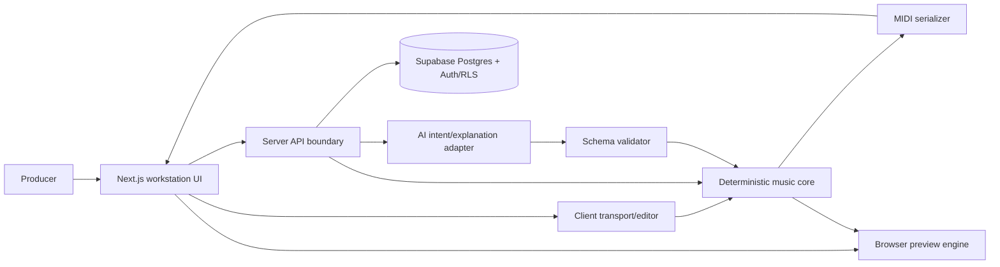

# Architecture

## Implementation status

Stage 2A implements the Next.js web adapter shell and engineering gates. Stage 3A adds only the framework-independent musical-time subset of `music-domain`; the remaining modules below are target architecture and do not exist yet. Technology status remains authoritative in [Decisions](DECISIONS.md).

## System shape

Use a TypeScript modular monolith: one Next.js `16.3.4` App Router application with explicit internal domains and server boundaries. The root application is intentionally not a monorepo. A workspace becomes justified only when a real independently consumed package or tooling boundary cannot be enforced in the root project. Supabase provides PostgreSQL and authentication when persistence enters scope; Vercel is the default web host. Deterministic music logic remains framework-independent and runnable in browser/server/tests where equivalent behavior can be guaranteed.

## Modules

- `music-domain`: immutable typed theory and musical-time primitives.
- `composition`: project/section/track/pattern aggregates and invariants.
- `generators`: harmony, bass, arp, motif engines with versioned inputs and seeds.
- `midi`: canonical-to-SMF conversion, deterministic ordering, validation.
- `preview`: scheduling adapter and simple role-specific voices; canonical state is never derived from audio timing.
- `editor`: commands, validation, undo/redo, and revision creation.
- `persistence`: repositories, transactions, ownership, schema migration.
- `ai`: provider-neutral intent/explanation ports, prompts, schemas, policy, telemetry.
- `recipes`: synth profiles/recipes and deterministic validation.
- `web`: UI composition and API adapters.

Dependencies point inward: web/persistence/AI/MIDI adapters depend on domain contracts; domain logic does not depend on Next.js, Supabase, Vercel, Web Audio, or an AI provider.

### Implemented boundaries

- `src/app`: Next.js routes, semantic layout, state pages, global tokens/styles, and HTTP adapters only.
- `src/app/api/health/live`: deterministic, non-cacheable process liveness without dependency or secret disclosure.
- `src/music-domain`: plain TypeScript canonical musical-time values and operations. Production files accept only relative imports; a test enforces the absence of framework, platform, and package dependencies.
- Root tool configuration: exact runtime/dependency policy, strict TypeScript, Biome, Vitest/jsdom/axe-core, and CI.
- No theory, composition, generator, MIDI, audio, persistence, AI, or provider module is created prematurely.

Framework-independent modules live outside `src/app`, expose plain TypeScript APIs, and contain no `next/*`, React, DOM, Node-only, database, or provider imports unless the module is explicitly an adapter. The Stage 3A dependency-boundary test enforces this rule for `src/music-domain` production files.

## Canonical flow

1. Validate and normalize a brief.
2. Resolve explicit versions and seed.
3. Generate immutable canonical domain output.
4. Validate aggregate invariants and compute a canonical hash.
5. Persist the generation record/result transactionally when authenticated.
6. Derive preview scheduling and MIDI independently from canonical state.
7. Treat AI output only as a proposed, validated parameter command or explanation.

## Client versus server

Pure deterministic generation may run client-side for low latency only if cross-runtime reproducibility is proven. Authorization, persistence, cost-bearing AI, audit logging, and privileged operations run server-side. The server revalidates all client-produced canonical payloads; client validation is usability, not security.

## Reliability boundaries

- Generation calls are idempotent by user + operation key + normalized request hash.
- Persist generation record and canonical result in one transaction.
- Failed AI calls cannot corrupt or block deterministic editing/export.
- Preview clock drift never updates canonical ticks.
- Export validates a frozen composition revision, not mutable UI state.
- Schema and generator versions are explicit; migrations never silently reinterpret history.

## Browser audition expectations

The Stage 9 spike must measure foreground desktop scheduling against canonical tick-derived target times. Initial targets are no more than 20 ms p95 note-start error, 25 ms loop-boundary discontinuity, and 10 ms accumulated relative track drift across an 8-bar preview on the declared supported browser/device matrix. These are preview-quality targets, not production-audio guarantees, and may be revised only with recorded measurements. Tab suspension, audio-device changes, CPU pressure, timer throttling, resume gestures, and mobile browser policies must produce an explicit paused/degraded state rather than advancing canonical time incorrectly.

## Deferred scaling

No queue or worker is justified for current Version 1 latency assumptions. Introduce an asynchronous boundary only when measured timeouts, concurrency, or provider behavior require it; preserve API/job contracts so such a change is possible.
