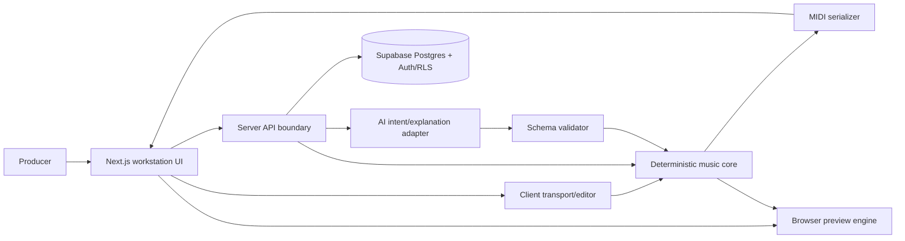

# Architecture

## Implementation status

Stage 2A implements the Next.js web adapter shell and engineering gates. The framework-independent domain now includes musical time, pitch, interval, scale, Key, ChordQuality, Chord, ChordInversion, ChordVoicing, and the versioned PRNG. Bounded Harmony runtime includes the immutable template catalog, profile-constrained hard-valid voicing candidate enumeration, adjacent voice-leading cost, and deterministic candidate selection. Stage 5B1/B2a/B2b provide the owned MIDI IR, isolated serializer, and independent reference evidence; Stage 5C1 provides the controlled fixture/interoperability record; Stage 5D1 provides a browser-only adapter for already-produced MIDI bytes; Stage 6A1/A2 provide the deterministic root-aligned Bass baseline, and Stage 6 straight-rhythm implementation is merged. Stage 7B1 provides the accepted and merged Arpeggiator candidate foundation, and Stage 7B2 provides the accepted and merged fixed-eighth canonical event projection. Stage 7B3 rate/direction expansion and Stage 7B4 integer-gate control are accepted and merged. Stage 7C1, Stage 7C2, Stage 7C3, Stage 7C-P1, Stage 7C4, Stage 7C5, and Stage 7C6 contracts are accepted and merged. Stage 7C7a1 adds only the reusable component-seed derivation primitive, Stage 7C7a2 adds only the internal deterministic weighted-choice primitive, Stage 7C7a3 adds only the internal immutable density-mask catalog and deterministic lookup, Stage 7C7a4 adds only the accepted shared canonical Energy/Complexity runtime boundary, and Stage 7C7a5 adds only the shared Arpeggiator policy-configuration foundation. Stage 7C7a6 is accepted and merged through PR #92 at approved head `a7193128e9d8febcee6cca306a0f07fc1c6cc41a` with merge commit `e4ae8e8675a83e69752362565f94b73907ded10a`; it provides the internal immutable genre-profile configuration and deterministic validation/construction boundary. Stage 7C7a7 module-private policy resolution is accepted and merged through PR #94 at approved head `133c7f6fecc2a78ea4278fb7b44921a2484a0c13` with merge commit `afbe3493841ef38a62eb961368a2f1147f008725`. Stage 7C7a8 resolved-plan projection is accepted and merged through PR #96 at approved head `43d251c4c95d39f60320ad90bd80522c514d721c` with merge commit `a14b6e100d00464e314309b45813943e6f81b83a`; the public enclosing Stage 7C operation is accepted and merged through PR #98 at approved head `d4373c60cb3242058df4bc1c898ccb2d465f0741` with merge commit `6f5e1d26e9f48a678f5c995538fdb218d29fd39d`. Full progression generation/optimization, seeded Harmony variation, broader MIDI compatibility, package/export UX, compound and expressive Bass rhythm expansion, melody, AI generation, and persistence remain target architecture and are not implemented. Technology status remains authoritative in [Decisions](DECISIONS.md).

## System shape

Use a TypeScript modular monolith: one Next.js `16.3.4` App Router application with explicit internal domains and server boundaries. The root application is intentionally not a monorepo. A workspace becomes justified only when a real independently consumed package or tooling boundary cannot be enforced in the root project. Supabase provides PostgreSQL and authentication when persistence enters scope; Vercel is the default web host. Deterministic music logic remains framework-independent and runnable in browser/server/tests where equivalent behavior can be guaranteed.

## Modules

- `music-domain`: immutable typed theory and musical-time primitives.
- `composition`: project/section/track/pattern aggregates and invariants.
- `generators`: harmony, bass, arp, motif engines with versioned inputs and seeds.
- `midi`: canonical-to-SMF conversion, deterministic ordering, validation.
- `preview`: scheduling adapter and simple role-specific voices; canonical state is never derived from audio timing.
- `editor`: commands, validation, undo/redo, and revision creation.
- `persistence`: repositories, transactions, ownership, schema migration.
- `ai`: provider-neutral intent/explanation ports, prompts, schemas, policy, telemetry.
- `recipes`: synth profiles/recipes and deterministic validation.
- `web`: UI composition and API adapters.

Dependencies point inward: web/persistence/AI/MIDI adapters depend on domain contracts; domain logic does not depend on Next.js, Supabase, Vercel, Web Audio, or an AI provider.

Commodity mechanisms may use evaluated third-party libraries behind adapters, but canonical Nightdrive musical semantics remain defined by the framework-independent domain contracts.

Stage 7A defines the [Arpeggiator foundation](ARPEGGIATOR_MODEL.md), and the merged Stage 7B runtime consumes validated Harmony progression slots and their selected `ChordVoicing`, owns only component-specific pitch traversal and `ArpEvent` projection, and reuses canonical musical-time primitives. Harmony retains Chord, inversion, voicing, slot-order, and bar-span ownership; MIDI, aggregate provenance, browser/audio, persistence, and AI remain downstream or enclosing boundaries.

Stage 7C separates deterministic Arpeggiator policy resolution from canonical event projection. The public enclosing Stage 7C Arpeggiator domain operation receives the canonical root seed and complete versioned request, owns the Stage 7C5 preflight, and only after successful preflight derives the fixed `arpeggiator` component seed. A module-private policy resolver consumes that derived seed and returns a frozen inspectable plan; a module-private projector consumes the complete plan plus the already validated Harmony progression and range. This preserves a single public failure precedence and prevents either helper from bypassing preflight. The reusable cross-component seed-derivation primitive owns its neutral boundary-specific structured error rather than an Arpeggiator error class; the Stage 7C operation validates and reports its own root-seed failure before invoking that primitive. Harmony remains authoritative for selected voicings; component-seed derivation, policy, profile, generator, and schema versions remain replay boundaries; aggregate warnings, hashes, persistence, serialization, and provenance remain outside `ArpEvent` and the Stage 7C result. Stage 7C1–C6 are accepted and merged, with Stage 7C6 recorded through PR #82 (approved head `82ca76bbb046669529d1515a2f534649e4d5675e`, merge commit `5d512548e4683ad90ec1c0eb5af3cdc9e72a73fb`). Stage 7C7a1 implements only the reusable component-seed primitive, Stage 7C7a2 implements only the internal generic weighted-choice primitive, Stage 7C7a3 implements only the module-internal immutable Stage 7C1 density-mask catalog and deterministic lookup, and Stage 7C7a4 implements the accepted `src/music-domain/composition-intent.ts` boundary for the distinct shared canonical `EnergyV1` and `ComplexityV1` domains. Stage 7C7a5 is accepted and merged through PR #90 at approved head `d2b18ca3156d358693e1d00456cde1558afcca51` with merge commit `e87e270745b6fe219df8b0cd76f47f47ded03400`; its direct module contains only recursively immutable shared policy identities, closed domains, decision schedule, compatibility, exact semantic gate mappings, and private validation. Stage 7C7a6 is accepted and merged through PR #92 at approved head `a7193128e9d8febcee6cca306a0f07fc1c6cc41a` with merge commit `e4ae8e8675a83e69752362565f94b73907ded10a`; its direct module contains only recursively immutable profile data, structural validation, and deterministic candidate-list construction. Stage 7C7a7 implements only the module-private deterministic policy resolver and is accepted and merged through PR #94 at approved head `133c7f6fecc2a78ea4278fb7b44921a2484a0c13` with merge commit `afbe3493841ef38a62eb961368a2f1147f008725`. Stage 7C7a8 implements only the module-private resolved-plan projector and is accepted and merged through PR #96 at approved head `43d251c4c95d39f60320ad90bd80522c514d721c` with merge commit `a14b6e100d00464e314309b45813943e6f81b83a`. The public enclosing operation is accepted and merged through PR #98 at approved head `d4373c60cb3242058df4bc1c898ccb2d465f0741` with merge commit `6f5e1d26e9f48a678f5c995538fdb218d29fd39d`; it composes those accepted boundaries without adding aggregate provenance or later Stage 7 behavior.

Stage 5A defined the MIDI boundary. Stage 5B1 provides a framework-independent Nightdrive-owned intermediate representation and strict validators for validated canonical composition/timing inputs. Stage 5B2a passes that validated IR through an isolated Standard MIDI adapter using `midi-file` only for commodity byte encoding; the public boundary remains Nightdrive-owned and third-party MIDI types do not cross it. Stage 5B2b adds a test-only independent validation/reference reader and semantic round-trip evidence; it is not canonical state or a production parser. Stage 5C1 prepares a committed serializer-generated interoperability fixture and manual FL Studio protocol; it does not automate FL Studio or claim compatibility.

The accepted [Stage 7 Arpeggiator audition-artifact contract](reviews/STAGE7_ARPEGGIATOR_AUDITION_ARTIFACT.md) defines an evaluation-only adapter from accepted Harmony plus Arp outputs to the existing Nightdrive MIDI IR. The merged `src/evaluation/stage7-arpeggiator-midi-ir.ts` assembler remains noncanonical and outside the public music-domain API. Accepted fixture tooling in `src/evaluation`, merged through PR #105, reconstructs the frozen source/matrix, invokes the public Stage 7C operation, reuses that assembler and the existing MIDI serializer, and derives bytes, hashes, deterministic JSON evidence, and a presentation-only blind mapping. Its separate Node materializer requires an explicit fresh directory and complete preflight before mutation; the real 28-fixture package is generated outside the repository. No dependency flows back into the music domain, and no second MIDI schema/serializer, aggregate provenance, browser/Web Audio path, application route, or persistence boundary is introduced. The corrected listening setup, locked Pass 1/Pass 2 evidence, and deterministic policy-sensitivity diagnostic are recorded in the [Stage 7 evaluation results](reviews/STAGE7_ARPEGGIATOR_EVALUATION_RESULTS.md). These exploratory baseline results alone do not establish V2 musical acceptance. Public V2 runtime is accepted through PR #131; the linked results record now documents the Product Owner's bounded R1/V2 acceptance and waiver of the remaining matched comparison after 35 fixtures, without changing any module ownership or architecture. Aggregate generator/provenance integration remains unimplemented and separately gated; Stage 7 is open and Stage 8 unauthorized.

### Implemented boundaries

- `src/app`: Next.js routes, semantic layout, state pages, global tokens/styles, and HTTP adapters only.
- `src/app/api/health/live`: deterministic, non-cacheable process liveness without dependency or secret disclosure.
- `src/music-domain`: plain TypeScript canonical musical-time, pitch-identity, signed chromatic-interval, scale-formula, and Key values and operations. Production files accept only relative imports; a test covers static, dynamic, re-export, and side-effect-only forms to enforce the absence of framework, platform, and package dependencies.
- Root tool configuration: exact runtime/dependency policy, strict TypeScript, Biome, Vitest/jsdom/axe-core, and CI.
- No named/diatonic interval, note spelling, key/chord theory, composition, generator, full MIDI export workflow, audio, persistence, AI, or provider module is created prematurely; the accepted bounded MIDI IR/serializer/browser-delivery slices remain the only MIDI implementation slices.

Framework-independent modules live outside `src/app`, expose plain TypeScript APIs, and contain no `next/*`, React, DOM, Node-only, database, or provider imports unless the module is explicitly an adapter. The Stage 3A dependency-boundary test enforces this rule for `src/music-domain` production files.

## Canonical flow

1. Validate and normalize a brief.
2. Resolve explicit versions and seed.
3. Generate immutable canonical domain output.
4. Validate aggregate invariants and compute a canonical hash.
5. Persist the generation record/result transactionally when authenticated.
6. Derive preview scheduling and MIDI independently from canonical state.
7. Treat AI output only as a proposed, validated parameter command or explanation.

## Client versus server

Pure deterministic generation may run client-side for low latency only if cross-runtime reproducibility is proven. Authorization, persistence, cost-bearing AI, audit logging, and privileged operations run server-side. The server revalidates all client-produced canonical payloads; client validation is usability, not security.

## Reliability boundaries

- Generation calls are idempotent by user + operation key + normalized request hash.
- Persist generation record and canonical result in one transaction.
- Failed AI calls cannot corrupt or block deterministic editing/export.
- Preview clock drift never updates canonical ticks.
- Export validates a frozen composition revision, not mutable UI state.
- Schema and generator versions are explicit; migrations never silently reinterpret history.

## Browser audition expectations

The Stage 9 spike must measure foreground desktop scheduling against canonical tick-derived target times. Initial targets are no more than 20 ms p95 note-start error, 25 ms loop-boundary discontinuity, and 10 ms accumulated relative track drift across an 8-bar preview on the declared supported browser/device matrix. These are preview-quality targets, not production-audio guarantees, and may be revised only with recorded measurements. Tab suspension, audio-device changes, CPU pressure, timer throttling, resume gestures, and mobile browser policies must produce an explicit paused/degraded state rather than advancing canonical time incorrectly.

## Deferred scaling

No queue or worker is justified for current Version 1 latency assumptions. Introduce an asynchronous boundary only when measured timeouts, concurrency, or provider behavior require it; preserve API/job contracts so such a change is possible.
