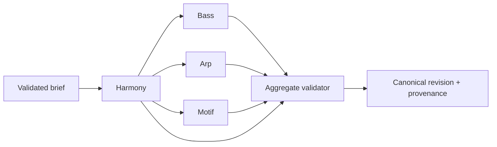

# Composition engine design

## Shared generator contract

Every generator receives a validated frozen context, target component, current/locked components and hashes, engine/generator/profile/schema versions, bounded parameters, and explicit seed. It returns canonical events, decisions/provenance, warnings, result hash, and structured errors. No ambient time, global random source, network, AI, database, locale, or unordered iteration may affect output.

## Pipeline

Targeted regeneration loads authoritative harmony and locked components. The aggregate validator rejects changes whose hashes differ from submitted locks.

## Harmony engine

Inputs: key/scale, profile/section, tension, complexity, movement, voicing width/range, seed. Responsibilities: select a profile-approved functional/degree template; construct chords; choose inversions/voicings; optimize voice-leading under hard constraints and deterministic tie breaks. Return a structured unsatisfiable result rather than silently violating hard constraints.

## Bass engine

Stage 6 V1 receives a validated Harmony progression, uses each slot's Chord root, and selects the first legal root pitch nearest MIDI `43`, then each later slot pitch nearest the prior resolved Bass pitch, choosing the lower pitch on ties within the approved `36..60` range. The bounded straight-rhythm implementation projects that one slot pitch as `sustained`, straight quarter/eighth/sixteenth pulses, or the exact contracted offbeat-eighth pattern using integer slot-local timing. Omitted rhythm preserves the sustained one-event-per-slot baseline. The current Bass runtime has no seed input and reads no ambient randomness; seed lineage remains owned by the future enclosing generator boundary. Passing, approach, pedal, slash/inversion, compound or generalized syncopation/rest, cross-slot-tie, and profile-specific behavior are not active. The six named archetypes—Driving 8ths, Driving 16ths, Midtempo Stomp, Pedal Tone, Octave Pulse, and Syncopated Darkwave—and their eventual parameters remain separately authorized future slices; they must not be inferred from this contract.

## Arpeggiator

Parameters: subdivision, direction (`up`, `down`, `upDown`, `alternate`, `seededRandom`, profile pattern), range, gate, octave span, density, seed. Active chord/voicing is the pitch source unless a documented profile transform permits scale tones. Ordering, octave wrap, rests, and random choices are deterministic.

## Melody/motif engine

Represent motif identity as a base interval/rhythm contour plus transformations. Build phrases using repetition, transposition, rhythmic displacement/augmentation where supported, call/response, chord targets, passing/tension notes, resolution, register/range, and leap/recovery constraints. Candidate scoring and tie breaking are deterministic and explainable; no arbitrary LLM note stream.

## Reproducibility and lineage

Specify and version the PRNG/seed encoding, parameter normalization, generator ordering, candidate sorting, and canonical serializer. A variation creates a child run/revision. Manual edits create a new revision with command provenance. History is not overwritten.

## Explanation records

Generators emit machine-readable decision codes and references (for example, selected template, voice-leading cost, archetype, target-tone position). AI or deterministic text may explain those records but cannot rewrite them.
