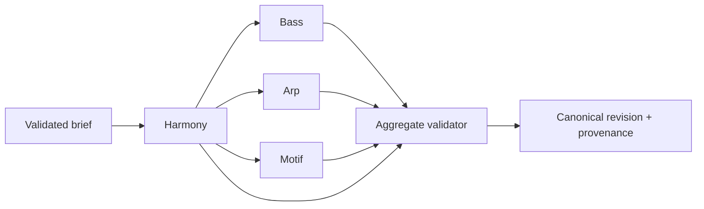

# Composition engine design

## Shared generator contract

Every generator receives a validated frozen context, target component, current/locked components and hashes, engine/generator/profile/schema versions, bounded parameters, and explicit seed. It returns canonical events, decisions/provenance, warnings, result hash, and structured errors. No ambient time, global random source, network, AI, database, locale, or unordered iteration may affect output.

## Normalized composition-intent energy and complexity

The normalized V1 composition brief owns two independent canonical intent dimensions:

```ts
type EnergyV1 = "very-low" | "low" | "medium" | "high" | "very-high";

type ComplexityV1 = "very-low" | "low" | "medium" | "high" | "very-high";
```

Both domains have the exact ordinal order `very-low < low < medium < high < very-high`. The order is a stable policy-comparison relation only: it does not assign numeric spacing, percentages, probabilities, arithmetic, interpolation, or a continuous scale.

| Level | `EnergyV1` meaning | `ComplexityV1` meaning |
|---|---|---|
| `very-low` | The lowest shared level of intended musical intensity and activity; downstream realization remains inside the active bounded profile and does not require silence. | The lowest shared level of intended structural or musical intricacy; downstream realization remains inside the active bounded profile and does not require fewer notes. |
| `low` | Restrained intended intensity and activity below the neutral default. | Restrained intended intricacy and policy variety below the neutral default. |
| `medium` | Neutral/default intended intensity and activity. | Neutral/default intended intricacy and policy variety. |
| `high` | Elevated intended intensity and activity above the neutral default. | Elevated intended intricacy and policy variety above the neutral default. |
| `very-high` | The highest shared level of intended intensity and activity; downstream realization remains inside the active bounded profile. | The highest shared level of intended intricacy and policy variety; downstream realization remains inside the active bounded profile. |

Energy may inform bounded rhythmic activity, density, register expansion, articulation/gate tendency, movement, or intensity policy. Complexity may inform bounded rhythmic variation, pattern variety, harmonic or melodic elaboration, transformation choice, or permissible policy diversity. Complexity is not a synonym for note count. Neither dimension directly authorizes notes, events, structural changes, or behavior outside the active generator and profile contracts.

The dimensions are orthogonal. Every one of the 25 ordered `EnergyV1`/`ComplexityV1` pairs is valid, including high energy with low complexity, low energy with high complexity, medium with medium, and very-high energy with very-low complexity. No implementation may collapse them into one score or infer one from the other.

Composition-brief creation/defaulting owns omission normalization. If the raw creation input omits energy or complexity, that field becomes the exact canonical value `medium`. A validated normalized brief consumed by deterministic generators must contain both fields explicitly. At that canonical boundary a present value is valid only when it is one exact case-sensitive identifier above; `undefined`, wrong-case or whitespace variants, aliases, unknown strings, numbers including fractions, booleans, `null`, arrays, and objects are invalid without trimming, case folding, clamping, interpolation, numeric parsing, synonym translation, or other coercion. A UI or AI adapter may interpret user language only before this boundary and must emit one schema-valid canonical identifier.

These identifiers, their order, meanings, independence, and omission defaults belong to the composition-brief schema/version boundary, not to Arpeggiator, Harmony, Bass, motif, a genre profile, AI, or UI state. Historical normalized briefs retain explicit energy and complexity values with their schema and generation lineage. Adding, removing, or renaming an identifier, changing order or meaning, or changing omission/default behavior requires an appropriate new composition-brief schema version rather than silently reinterpreting history. Each downstream generator consumes the two explicit values and maps them only through its own separately versioned bounded policy; different genre profiles may therefore produce different deterministic consequences from the same canonical pair.

## Pipeline



Targeted regeneration loads authoritative harmony and locked components. The aggregate validator rejects changes whose hashes differ from submitted locks.

## Harmony engine

Inputs: key/scale, profile/section, tension, complexity, movement, voicing width/range, seed. Responsibilities: select a profile-approved functional/degree template; construct chords; choose inversions/voicings; optimize voice-leading under hard constraints and deterministic tie breaks. Return a structured unsatisfiable result rather than silently violating hard constraints.

## Bass engine

Stage 6 V1 receives a validated Harmony progression, uses each slot's Chord root, and selects the first legal root pitch nearest MIDI `43`, then each later slot pitch nearest the prior resolved Bass pitch, choosing the lower pitch on ties within the approved `36..60` range. The bounded straight-rhythm implementation projects that one slot pitch as `sustained`, straight quarter/eighth/sixteenth pulses, or the exact contracted offbeat-eighth pattern using integer slot-local timing. Omitted rhythm preserves the sustained one-event-per-slot baseline. The current Bass runtime has no seed input and reads no ambient randomness; seed lineage remains owned by the future enclosing generator boundary. Passing, approach, pedal, slash/inversion, compound or generalized syncopation/rest, cross-slot-tie, and profile-specific behavior are not active. The six named archetypes—Driving 8ths, Driving 16ths, Midtempo Stomp, Pedal Tone, Octave Pulse, and Syncopated Darkwave—and their eventual parameters remain separately authorized future slices; they must not be inferred from this contract.

## Arpeggiator

Stage 7A defines the deterministic foundation over a validated Harmony progression. Stage 7B1 implements exact selected-voicing range filtering, and accepted merged Stage 7B2 projects monophonic immutable `ArpEvent` values at fixed eighth rate, ascending direction, full-step gate, and slot-local reset. Stage 7B3 rate/direction expansion is accepted and merged through a complete optional third `ArpTraversalParametersV1` argument containing required rate (`quarter|eighth|sixteenth`) and direction (`up|down|up-down|down-up`) fields; omitting the argument preserves the Stage 7B2 defaults. Stage 7B4 integer gate control is accepted and merged through PR #68: it adds optional integer `gateTicks` to that same argument, treats absence or explicit `undefined` as the selected-rate full-step default, and changes duration only. Inclusive absolute MIDI range remains the second argument. See [Arpeggiator model](ARPEGGIATOR_MODEL.md) for normative cycles, validation, and boundary behavior.

Stage 7C defines two separate conceptual layers. A deterministic policy resolver consumes normalized intent, profile/version, energy/complexity, and an Arpeggiator component seed and returns a bounded resolved Arp plan containing rate, direction, gate, octave range, and `maskId: ArpDensityMaskIdV1` governed by the versioned mask catalog. Canonical event projection consumes that plan and the validated Harmony realization. It may add only permitted upward octave equivalents of Harmony-selected pitches and may mask traversal steps, but it never selects a replacement voicing, invents chord/scale tones, or makes random note decisions. Stage 7B calls remain compatible: octave range `1`, the `full` mask, and the existing explicit/default traversal parameters reproduce the accepted pitch and event behavior.

The enclosing generator, not `ArpEvent`, owns root seed, component-seed derivation version, PRNG version, Arp policy version, profile version, generator/schema versions, normalized inputs, lineage, and hashes. It derives one component seed per stable named musical component; a single mutable composition-wide PRNG stream and per-parameter seed trees are prohibited. Stage 7C2 accepts one generic replay-versioned weighted-choice mechanism: preserve each policy's declared candidate order, sum raw integer weights exactly without normalization, map exactly one supplied uint32 output with modulo into half-open cumulative intervals, and consume that output even for a single candidate. Zero-weight candidates remain ordered but unselectable; no sorting, floating probability, rejection sampling, or additional PRNG output is permitted. Stage 7C3 accepts exact domain-separated MurmurHash3 x86_32 derivation from the canonical root seed and one closed stable component ID; the normative byte layout and vectors live in the Arpeggiator model. Exact profile candidate sets and weights, runtime errors, and Stage 7C implementation remain separately gated.

## Melody/motif engine

Represent motif identity as a base interval/rhythm contour plus transformations. Build phrases using repetition, transposition, rhythmic displacement/augmentation where supported, call/response, chord targets, passing/tension notes, resolution, register/range, and leap/recovery constraints. Candidate scoring and tie breaking are deterministic and explainable; no arbitrary LLM note stream.

## Reproducibility and lineage

Specify and version PRNG state advancement, root-to-component seed derivation, generator policy, profile data, parameter normalization, generator ordering, candidate sorting, and the canonical serializer. Replay-relevant changes use the appropriate version boundary rather than silently changing historical output. A variation creates a child run/revision. Manual edits create a new revision with command provenance. History is not overwritten.

## Explanation records

Generators emit machine-readable decision codes and references (for example, selected template, voice-leading cost, archetype, target-tone position). AI or deterministic text may explain those records but cannot rewrite them.
