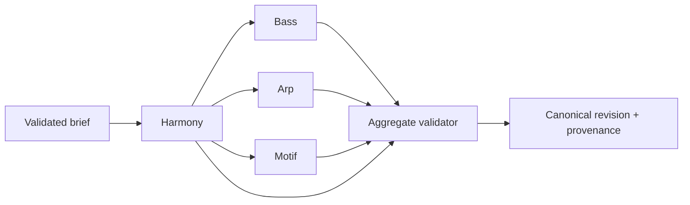

# Composition engine design

## Shared generator contract

Every generator receives a validated frozen context, target component, current/locked components and hashes, engine/generator/profile/schema versions, bounded parameters, and explicit seed. It returns canonical events, decisions/provenance, warnings, result hash, and structured errors. No ambient time, global random source, network, AI, database, locale, or unordered iteration may affect output.

## Normalized composition-intent energy and complexity

The normalized V1 composition brief owns two independent canonical intent dimensions:

```ts
type EnergyV1 = "very-low" | "low" | "medium" | "high" | "very-high";

type ComplexityV1 = "very-low" | "low" | "medium" | "high" | "very-high";
```

Both domains have the exact ordinal order `very-low < low < medium < high < very-high`. The order is a stable policy-comparison relation only: it does not assign numeric spacing, percentages, probabilities, arithmetic, interpolation, or a continuous scale.

| Level | `EnergyV1` meaning | `ComplexityV1` meaning |
|---|---|---|
| `very-low` | The lowest shared level of intended musical intensity and activity; downstream realization remains inside the active bounded profile and does not require silence. | The lowest shared level of intended structural or musical intricacy; downstream realization remains inside the active bounded profile and does not require fewer notes. |
| `low` | Restrained intended intensity and activity below the neutral default. | Restrained intended intricacy and policy variety below the neutral default. |
| `medium` | Neutral/default intended intensity and activity. | Neutral/default intended intricacy and policy variety. |
| `high` | Elevated intended intensity and activity above the neutral default. | Elevated intended intricacy and policy variety above the neutral default. |
| `very-high` | The highest shared level of intended intensity and activity; downstream realization remains inside the active bounded profile. | The highest shared level of intended intricacy and policy variety; downstream realization remains inside the active bounded profile. |

Energy may inform bounded rhythmic activity, density, register expansion, articulation/gate tendency, movement, or intensity policy. Complexity may inform bounded rhythmic variation, pattern variety, harmonic or melodic elaboration, transformation choice, or permissible policy diversity. Complexity is not a synonym for note count. Neither dimension directly authorizes notes, events, structural changes, or behavior outside the active generator and profile contracts.

The dimensions are orthogonal. Every one of the 25 ordered `EnergyV1`/`ComplexityV1` pairs is valid, including high energy with low complexity, low energy with high complexity, medium with medium, and very-high energy with very-low complexity. No implementation may collapse them into one score or infer one from the other.

Composition-brief creation/defaulting owns omission normalization. If the raw creation input omits energy or complexity, that field becomes the exact canonical value `medium`. A validated normalized brief consumed by deterministic generators must contain both fields explicitly. At that canonical boundary a present value is valid only when it is one exact case-sensitive identifier above; `undefined`, wrong-case or whitespace variants, aliases, unknown strings, numbers including fractions, booleans, `null`, arrays, and objects are invalid without trimming, case folding, clamping, interpolation, numeric parsing, synonym translation, or other coercion. A UI or AI adapter may interpret user language only before this boundary and must emit one schema-valid canonical identifier.

These identifiers, their order, meanings, independence, and omission defaults belong to the composition-brief schema/version boundary, not to Arpeggiator, Harmony, Bass, motif, a genre profile, AI, or UI state. Historical normalized briefs retain explicit energy and complexity values with their schema and generation lineage. Adding, removing, or renaming an identifier, changing order or meaning, or changing omission/default behavior requires an appropriate new composition-brief schema version rather than silently reinterpreting history. Each downstream generator consumes the two explicit values and maps them only through its own separately versioned bounded policy; different genre profiles may therefore produce different deterministic consequences from the same canonical pair.

### Stage 7C7a4 canonical runtime boundary

Stage 7C7a4 is the accepted and merged smallest shared runtime representation of the Stage 7C-P1 domains. It is merged through PR #88 at approved head `5844ef48bdaf98bb638b081d8eb610842b90cc42` with merge commit `8ebc73a71703893ca1afa608b96264d0db51ee12`. The implementation belongs in the framework-independent composition-intent domain at `src/music-domain/composition-intent.ts`; it does not live in an Arpeggiator-specific module or implement the broader future composition-brief schema. The module owns only these two shared fields, their creation defaults, canonical validation, immutable normalized pair, and neutral shared-domain failures.

The exact TypeScript boundary is:

```ts
export const ENERGY_V1_VALUES = Object.freeze([
  "very-low",
  "low",
  "medium",
  "high",
  "very-high",
] as const);

export const COMPLEXITY_V1_VALUES = Object.freeze([
  "very-low",
  "low",
  "medium",
  "high",
  "very-high",
] as const);

export type EnergyV1 = (typeof ENERGY_V1_VALUES)[number];
export type ComplexityV1 = (typeof COMPLEXITY_V1_VALUES)[number];

export type CompositionIntentCreationInputV1 = Readonly<{
  energy?: unknown;
  complexity?: unknown;
}>;

export type NormalizedCompositionIntentV1 = Readonly<{
  energy: EnergyV1;
  complexity: ComplexityV1;
}>;

export type CompositionIntentErrorCode = "INVALID_ENERGY" | "INVALID_COMPLEXITY";
export type CompositionIntentErrorField = "energy" | "complexity";

export class CompositionIntentValueError extends RangeError {
  readonly code: CompositionIntentErrorCode;
  readonly field: CompositionIntentErrorField;
}

export function normalizeCompositionIntentV1(
  input: CompositionIntentCreationInputV1,
): NormalizedCompositionIntentV1;

export function validateNormalizedCompositionIntentV1(
  input: Readonly<{ energy: unknown; complexity: unknown }>,
): NormalizedCompositionIntentV1;
```

`ENERGY_V1_VALUES` and `COMPLEXITY_V1_VALUES` are distinct frozen tuples even though they contain the same V1 vocabulary. Their array positions preserve only the accepted ordinal order; positions are not scores, distances, percentages, probabilities, interpolation inputs, or authorization for arithmetic. The distinct derived types preserve independent semantic ownership and must not be collapsed into one interchangeable domain type. Internal membership machinery may be shared without changing that distinction.

`normalizeCompositionIntentV1` is the raw creation/defaulting boundary for these two fields only. An absent property or a property whose value is explicitly `undefined` is omission and becomes exact `medium`; therefore `{}`, `{ energy: undefined }`, `{ complexity: undefined }`, and `{ energy: undefined, complexity: undefined }` normalize to the corresponding explicit `medium` values. Every other present value must already be one exact case-sensitive identifier. Malformed present energy fails before malformed present complexity. This function performs no trimming, case folding, aliasing, parsing, clamping, interpolation, synonym translation, or other coercion, and it never falls back to `medium` for a malformed non-`undefined` value.

`validateNormalizedCompositionIntentV1` is the canonical boundary used before deterministic generators consume the pair. Both properties are required and explicit; an absent property or explicit `undefined` is invalid. It validates energy before complexity and accepts only the exact case-sensitive identifiers. Wrong-case or whitespace variants, aliases or synonyms, unknown strings, every number including integers, fractions, `NaN`, and infinities, booleans, `null`, arrays, and objects fail without coercion. Both functions return a newly frozen `NormalizedCompositionIntentV1` and never mutate their input or the frozen vocabulary tuples.

Direct failures use `CompositionIntentValueError`: malformed energy uses `INVALID_ENERGY` at `energy`, and malformed complexity uses `INVALID_COMPLEXITY` at `complexity`. The error contains no captured invalid-value property. These errors belong to the shared composition-intent boundary and are not `ArpValueError`. The accepted `generateArpEventsWithPolicyV1` operation owns its accepted Stage 7C5 `ArpValueError` fields `intent.energy` and `intent.complexity` and their precedence; Stage 7C7a4 neither adds nor changes an Arpeggiator code, field, message contract, translation, or precedence.

The canonical constants, canonical types, normalized result type, shared error types/class, and `validateNormalizedCompositionIntentV1` are shared music-domain exports through `src/music-domain/index.ts` for legitimate deterministic-generator use. `CompositionIntentCreationInputV1` and `normalizeCompositionIntentV1` remain direct-module exports only for the future composition-brief creation/defaulting boundary; they are not re-exported through the broad music-domain barrel. Downstream generators consume the already normalized explicit pair and must not invoke creation defaulting.

The boundary is pure and deterministic. It consumes no PRNG or seed and cannot depend on `Math.random()`, time, locale, network, AI, persistence, database state, environment, object/discovery order, or another ambient input. Equal valid inputs produce canonical-value-equivalent frozen outputs. No dependency is justified for these tiny replay-relevant Nightdrive-owned domains and rules.

Stage 7C7a4 implements only this shared canonical boundary. Stage 7C7a5 is accepted and merged through PR #90 at approved head `d2b18ca3156d358693e1d00456cde1558afcca51` with merge commit `e87e270745b6fe219df8b0cd76f47f47ded03400`; it implements only the shared Arpeggiator policy-configuration foundation. Stage 7C7a6 is accepted and merged through PR #92 at approved head `a7193128e9d8febcee6cca306a0f07fc1c6cc41a` with merge commit `e4ae8e8675a83e69752362565f94b73907ded10a`; it provides the separately gated direct-module runtime containing the exact four-profile data, structural validation, and deterministic Energy/Complexity vector addition. Stage 7C7a7 implements only module-private weighted selection, supplied component-seed PRNG consumption, gate resolution, and frozen resolved-plan construction and is accepted and merged through PR #94 at approved head `133c7f6fecc2a78ea4278fb7b44921a2484a0c13` with merge commit `afbe3493841ef38a62eb961368a2f1147f008725`. Stage 7C7a8 implements the module-private projector with upward octave expansion, canonical candidate construction, mask-aware slot-local traversal, and exact rate/gate event timing and is accepted and merged through PR #96 at approved head `43d251c4c95d39f60320ad90bd80522c514d721c` with merge commit `a14b6e100d00464e314309b45813943e6f81b83a`. The accepted enclosing operation/public preflight and its exact MIA-004 structured-error evidence are implemented and validation-complete through PR #98 at approved head `d4373c60cb3242058df4bc1c898ccb2d465f0741c` with merge commit `6f5e1d26e9f48a678f5c995538fdb218d29fd39d`; aggregate provenance, persistence, UI, MIDI generation integration, and browser/audio behavior remain outside that runtime slice. Current R1 human product acceptance is satisfied by the PR #142 exception.

## Pipeline



Targeted regeneration loads authoritative harmony and locked components. The aggregate validator rejects changes whose hashes differ from submitted locks.

## Harmony engine

Inputs: key/scale, profile/section, tension, complexity, movement, voicing width/range, seed. Responsibilities: select a profile-approved functional/degree template; construct chords; choose inversions/voicings; optimize voice-leading under hard constraints and deterministic tie breaks. Return a structured unsatisfiable result rather than silently violating hard constraints.

## Bass engine

Stage 6 V1 receives a validated Harmony progression, uses each slot's Chord root, and selects the first legal root pitch nearest MIDI `43`, then each later slot pitch nearest the prior resolved Bass pitch, choosing the lower pitch on ties within the approved `36..60` range. The bounded straight-rhythm implementation projects that one slot pitch as `sustained`, straight quarter/eighth/sixteenth pulses, or the exact contracted offbeat-eighth pattern using integer slot-local timing. Omitted rhythm preserves the sustained one-event-per-slot baseline. The current Bass runtime has no seed input and reads no ambient randomness; seed lineage remains owned by the future enclosing generator boundary. Passing, approach, pedal, slash/inversion, compound or generalized syncopation/rest, cross-slot-tie, and profile-specific behavior are not active. The six named archetypes—Driving 8ths, Driving 16ths, Midtempo Stomp, Pedal Tone, Octave Pulse, and Syncopated Darkwave—and their eventual parameters remain separately authorized future slices; they must not be inferred from this contract.

## Arpeggiator

Stage 7A defines the deterministic foundation over a validated Harmony progression. Stage 7B1 implements exact selected-voicing range filtering, and accepted merged Stage 7B2 projects monophonic immutable `ArpEvent` values at fixed eighth rate, ascending direction, full-step gate, and slot-local reset. Stage 7B3 rate/direction expansion is accepted and merged through a complete optional third `ArpTraversalParametersV1` argument containing required rate (`quarter|eighth|sixteenth`) and direction (`up|down|up-down|down-up`) fields; omitting the argument preserves the Stage 7B2 defaults. Stage 7B4 integer gate control is accepted and merged through PR #68: it adds optional integer `gateTicks` to that same argument, treats absence or explicit `undefined` as the selected-rate full-step default, and changes duration only. Inclusive absolute MIDI range remains the second argument. See [Arpeggiator model](ARPEGGIATOR_MODEL.md) for normative cycles, validation, and boundary behavior.

Stage 7C defines two separate conceptual layers. A deterministic policy resolver consumes normalized intent, profile/version, energy/complexity, and an Arpeggiator component seed and returns a bounded resolved Arp plan containing rate, direction, gate, octave range, and `maskId: ArpDensityMaskIdV1` governed by the versioned mask catalog. Canonical event projection consumes that plan and the validated Harmony realization. The active Stage 7C profile ID must equal the independently validated Harmony realization's canonical profile identity before seed derivation or policy selection; cross-profile policy reuse is invalid generation lineage. Projection may add only permitted upward octave equivalents of Harmony-selected pitches and may mask traversal steps, but it never selects a replacement voicing, invents chord/scale tones, or makes random note decisions. Stage 7B calls remain compatible: octave range `1`, the `full` mask, and the existing explicit/default traversal parameters reproduce the accepted pitch and event behavior.

The enclosing generator, not `ArpEvent`, owns root seed, component-seed derivation version, PRNG version, Arp policy version, profile version, generator/schema versions, normalized inputs, lineage, and hashes. The accepted `generateArpEventsWithPolicyV1(request)` boundary receives the root seed and complete canonical/versioned request, owns the Stage 7C5 preflight, derives the fixed `arpeggiator` component seed only after successful preflight, calls a module-private resolver, then calls a module-private projector. It returns a recursively frozen `{ plan, events }` result so the exact five-field `ResolvedArpPlanV1` is inspectable without becoming caller input or duplicating aggregate provenance. A single mutable composition-wide PRNG stream and per-parameter seed trees are prohibited. Stage 7C2 accepts one generic replay-versioned weighted-choice mechanism: preserve each policy's declared candidate order, sum raw integer weights exactly without normalization, map exactly one supplied uint32 output with modulo into half-open cumulative intervals, and consume that output even for a single candidate. Zero-weight candidates remain ordered but unselectable; no sorting, floating probability, rejection sampling, or additional PRNG output is permitted. Stage 7C3 accepts exact domain-separated MurmurHash3 x86_32 derivation from the canonical root seed and one closed stable component ID; the normative byte layout and vectors live in the Arpeggiator model. Stage 7C-P1 and the exact Stage 7C4 profile policy are accepted and merged. Stage 7C5 freezes boundary-owned structured errors and requires normalized intent, lineage, policy configuration, range, and Harmony preflight before any PRNG output; the exact taxonomy and precedence live in the Arpeggiator model. Stage 7C7a6 is accepted and merged through PR #92 at approved head `a7193128e9d8febcee6cca306a0f07fc1c6cc41a` with merge commit `e4ae8e8675a83e69752362565f94b73907ded10a`; it provides the profile-data boundary containing literal accepted tables, local `profile.version` validation, and construction of ordered raw `WeightedCandidate<T>` lists by exact `energyWeight + complexityAddition`. It neither invokes Stage 7C2 selection nor consumes a seed or PRNG output. Stage 7C7a7 policy resolution is accepted and merged through PR #94 at approved head `133c7f6fecc2a78ea4278fb7b44921a2484a0c13` with merge commit `afbe3493841ef38a62eb961368a2f1147f008725`; it does not move normalized-brief, seed-lineage, Harmony, or event-projection validation into the profile-data boundary or policy resolver. Stage 7C7a8 projection is accepted and merged through PR #96 at approved head `43d251c4c95d39f60320ad90bd80522c514d721c` with merge commit `a14b6e100d00464e314309b45813943e6f81b83a` without changing that ownership. The accepted PR #98 implementation composes those boundaries after complete preflight; it adds no aggregate provenance or later behavior.

## Melody/motif engine

Represent motif identity as a base interval/rhythm contour plus transformations. Build phrases using repetition, transposition, rhythmic displacement/augmentation where supported, call/response, chord targets, passing/tension notes, resolution, register/range, and leap/recovery constraints. Candidate scoring and tie breaking are deterministic and explainable; no arbitrary LLM note stream.

## Reproducibility and lineage

Specify and version PRNG state advancement, root-to-component seed derivation, generator policy, profile data, parameter normalization, generator ordering, candidate sorting, and the canonical serializer. Replay-relevant changes use the appropriate version boundary rather than silently changing historical output. A variation creates a child run/revision. Manual edits create a new revision with command provenance. History is not overwritten.

## Explanation records

Generators emit machine-readable decision codes and references (for example, selected template, voice-leading cost, archetype, target-tone position). AI or deterministic text may explain those records but cannot rewrite them.

## First Playable canonical composition contract

**Status:** Product Owner architecture decision accepted in [ADR-023](DECISIONS.md#adr-023--first-playable-canonical-harmonybassarpeggiator-composition-boundary). The coordinator, result value, serializer, and verifier implementation are accepted and merged through PR #175; pinned-Node/cross-runtime canonical evidence remains separately gated. It freezes one local, in-memory, root-record eight-bar section containing Harmony, Bass, and the accepted V2 Arpeggiator. It is not a raw composition-brief/UI contract, browser preview/audio contract, transport, persistence record, MIDI model, lock/variation graph, multi-section arrangement, or Stage 8/9 boundary.

### Ownership and operation

`generateFirstPlayableCompositionV1(request): Promise<FirstPlayableCompositionResultV1>` belongs in `src/generators/first-playable-composition.ts`. It owns request preflight and orchestration only. `src/composition/first-playable-composition.ts` owns the result value, canonical component projections, result validation, schema-directed serializer, component hashes, and result hash. Both are direct modules; no broad music-domain barrel export or HTTP/application service is introduced by this contract.

The coordinator executes exactly once in this order after owned request validation: (1) call `realizeHarmonyProgression(profile.id, getHarmonyTemplate(harmony.templateId), harmony.key)` once; (2) call `generateBassEvents` with that exact realization and normalized Bass values; (3) call `generateArpEventsWithPolicyV2` with that exact realization and the normalized V2 request; (4) validate/project/copy the three components, hash, and recursively freeze the result. It does not regenerate, copy-and-change, or select Harmony independently for either component. Harmony owns template/profile/Key compatibility, voicing selection, and its own failures; Bass owns root/rhythm projection; V2 owns policy preflight, component-seed derivation, resolution, projection, and its structured errors.

### Normalized request

All request records are ordinary own-data records; arrays are dense ordered own-data arrays. Required fields reject missing and explicit `undefined`; no trimming, parsing, case-folding, coercion, version inference, `latest`, caller callback, arbitrary configuration, or raw UI/mood input exists. The request rejects unknown own fields rather than allowing future fields to affect canonical identity. `null` is not accepted. The coordinator snapshots accepted values without mutating or freezing caller input.

```ts
type FirstPlayableCompositionRequestV1 = Readonly<{
  schema: "nightdrive.first-playable-composition-request.v1";
  engineVersion: "nightdrive.engine.first-playable-composition.v1";
  generatorVersion: "nightdrive.generator.first-playable-composition.v1";
  profile: Readonly<{ id: HarmonyProfileId }>;
  harmony: Readonly<{
    templateId: string;
    templateVersion: "v1";
    key: Key;
  }>;
  section: Readonly<{ tempo: Tempo }>;
  intent: NormalizedCompositionIntentV1;
  rootSeed: number;
  bass?: Readonly<{
    range?: BassRange;
    rhythm?: BassRhythmId;
  }>;
  arpeggiator: Readonly<{
    range: ArpRange;
    profile: Readonly<{ version: "nightdrive.genre-profile.arpeggiator.v2" }>;
    policy: Readonly<{ version: "nightdrive.arpeggiator-policy.v2" }>;
    seedDerivation: Readonly<{ version: "nightdrive.seed-derivation.component.v1" }>;
    prng: Readonly<{ version: "nightdrive.prng.mulberry32.v1" }>;
  }>;
}>;
```

`schema`, `engineVersion`, `generatorVersion`, `profile.id`, Harmony template ID/version, Key, Tempo, normalized explicit Energy/Complexity, root seed, Arpeggiator range, and all V2 wrappers are **CALLER REQUIRED**. The template is explicit because no accepted automatic profile-template selection policy exists. The Key embeds the accepted scale context; no separate scale field or auto-key behavior is admitted. Section meter, length, and PPQ are **DERIVED FROM THIS V1 SCHEMA** as 4/4, eight bars, and 960 PPQ. `bass` is **OPTIONAL ONLY AS AN ACCEPTED NORMALIZATION CONVENIENCE**: absent `bass`, absent `bass.range`, and absent `bass.rhythm` normalize respectively to `BASS_V1_RANGE` (`36..60`) and `sustained`, exactly as the accepted Bass V1 boundary already does. The canonical result always records the resulting explicit Bass range/rhythm. No Bass seed, Bass profile version, custom Bass policy, Arpeggiator plan, caller-supplied Harmony realization, component hash, parent, lock, author, timestamp, browser/device, MIDI, audio, UI, persistence, AI, Melody, or Motif field is permitted.

The V2 request is constructed only from the normalized request: the same realized Harmony; `arpeggiator.range`; `intent.energy` and `intent.complexity`; `profile.id`; and its exact V2 profile/policy/derivation/PRNG identities plus `rootSeed`. The coordinator neither accepts nor routes V1, a mixed pair, or an arbitrary version dispatcher. `profile.id` must equal the profile in the realized Harmony, and V2's accepted `INCOMPATIBLE_ARP_PROFILE_CONTEXT` / `profile.id` behavior remains the canonical cross-component profile failure.

### Root seed and lineage

The request root seed is the sole root random lineage value. Current Harmony realization is deterministic and unseeded; its profile/template/Key selection inputs and selected voicings are recorded as canonical state, but no imaginary Harmony seed, component seed, PRNG state, or random output is recorded. Bass V1 is deterministic and seed-independent; its range/rhythm are provenance and its events are canonical. Only the delegated V2 Arpeggiator derives the fixed `arpeggiator` component seed after its accepted complete preflight, using `nightdrive.seed-derivation.component.v1`, then consumes its one accepted Mulberry32 policy stream under `nightdrive.prng.mulberry32.v1`. Component seed, raw PRNG state/output, candidate lists, weights, cumulative arithmetic, and resolved plan are derived/transient and never enter the result. This intentionally asymmetric lineage is truthful and preserves component isolation.

### Canonical result, bytes, and hashes

`FirstPlayableCompositionResultV1` has exactly this canonical field order:

```text
schema, engineVersion, generatorVersion, section, components, provenance,
componentHashes, warnings, resultHash
```

- `schema` is `nightdrive.first-playable-composition-result.v1`; engine and generator identities are the corresponding request identities.
- `section` is `ppq`, `barCount`, `timeSignature`, `tempo` in that order, with fixed `960`, `8`, existing 4/4 primitive, and validated request Tempo.
- `components` is `harmony`, `bass`, `arpeggiator`. Harmony is the minimal canonical projection `profile`, `templateId`, `templateVersion`, `key`, `slots`, where slots retain only `index`, `degree`, `bars`, `chord`, `inversion`, `voicing`. Bass and Arpeggiator are their existing ordered three-number event arrays (`pitch`, `startTick`, `durationTicks`). Harmony `adjacentCost`, rationale, preferences/tie-break explanation, candidate data, and other realization metadata are excluded. The public V2 resolved plan is transient and excluded because its events and replay inputs suffice to reproduce it.
- `provenance` is `profile`, `harmonyTemplate`, `bass`, `arpeggiator`, `intent`, `rootSeed`, `parent` in that order. It contains only request identities/normalized values needed to replay: profile ID; template ID/version; normalized Bass range/rhythm; Arpeggiator range/profile/policy/derivation/PRNG versions; Energy/Complexity; root seed; and root-only `parent: null`.
- `componentHashes` is `harmony`, `bass`, `arpeggiator`, each lowercase 64-hex SHA-256. `warnings` is exactly frozen `[]`; `resultHash` is a lowercase 64-hex SHA-256.

The `composition` serializer rebuilds these owned objects in displayed order, uses existing primitive serializers for TimeSignature, Tempo, Key, Chord, inversion, and voicing, preserves component/event array order, and never enumerates input construction order or invoke caller `toJSON`. It reuses the accepted Stage 7 schema-directed JSON rules and deterministic UTF-8/SHA-256 adapter: UTF-8 without BOM; no whitespace/newline; exact case-sensitive strings; safe-integer minimal base-10 numbers; no `NaN`, infinity, bigint, undefined, sparse arrays, accessors, functions, symbols, cycles, or implicit omission. It is a new representation/version, not a general JSON canonicalizer and not the Stage 7 serializer.

`H(x)` is lowercase SHA-256 hex of that UTF-8 JSON. Each component hash serializes `{ schema, section, component }` in that key order with exact new identities `nightdrive.first-playable-harmony-component.v1`, `nightdrive.first-playable-bass-component.v1`, and `nightdrive.first-playable-arpeggiator-component.v1`. The result hash input is the complete normalized result through `warnings`, excluding `resultHash` entirely; the final serialization appends `resultHash` last. It is not the hash of the self-containing final JSON. Existing Stage 7 component/aggregate bytes and hashes remain unchanged; shared projection/adapter code may be reused only where this contract's inputs and ordering are identical.

### Failure precedence and immutability

The coordinator introduces only `FirstPlayableCompositionValueError extends RangeError` for its own envelope failures, with stable `code` and `field` and noncontractual message. Its minimal codes are `INVALID_FIRST_PLAYABLE_REQUEST` / `request`, `UNSUPPORTED_FIRST_PLAYABLE_SCHEMA` / `schema`, `UNSUPPORTED_FIRST_PLAYABLE_ENGINE_VERSION` / `engineVersion`, `UNSUPPORTED_FIRST_PLAYABLE_GENERATOR_VERSION` / `generatorVersion`, and `INVALID_FIRST_PLAYABLE_TEMPO` / `section.tempo.microsecondsPerQuarter`. It does not wrap component failures.

Preflight stops at the first failure: request record; schema/engine/generator identities; profile record/ID; Harmony template wrapper/ID/version; Key; Tempo; normalized intent in its accepted Energy-before-Complexity order; Bass range then rhythm normalization; Arpeggiator wrappers in accepted public V2 order through root seed. Only then realize Harmony exactly once. Harmony errors propagate unchanged; then Bass errors propagate unchanged; then V2 performs its complete existing public preflight and errors propagate unchanged. A valid profile/context mismatch is the existing V2 `INCOMPATIBLE_ARP_PROFILE_CONTEXT` at `profile.id`, before V2 seed/PRNG/resolver/projector work. No component seed or PRNG work occurs before V2's own successful preflight. Invalid aggregate construction, serialization, hash-adapter, or impossible post-component invariant failures are internal errors, not fabricated caller-invalid component errors. Every failure rejects without events, plan, component hashes, result hash, warning envelope, or partial canonical result.

The operation returns fresh recursively frozen ordinary result objects, arrays, primitives, provenance, hashes, and warnings. It aliases no caller-owned mutable reference, has stable declared ordering, and has no hidden mutable/global state. Equal complete normalized requests under supported identities yield canonical-value-equivalent results, identical canonical bytes, component hashes, and result hash in a qualified runtime. Ambient randomness, wall time, locale, network, database, persistence, browser/device state, AI, and discovery/object order cannot affect generation. Unsupported future component/version identities fail at their owning preflight; historical Stage 7 and V1/V2 component behavior is never migrated or reinterpreted.

The initial byte/hash evidence boundary for this new canonical result is the supported pinned Node runtime, following the accepted Stage 7 AC-004 pattern but requiring separate evidence for this schema. Browser preview may consume the result later but cannot originate trusted canonical generation until separately qualified against accepted Node golden vectors.

### Stage 7 isolation and implementation evidence

This boundary is separate from `generateStage7ArpeggiatorAggregateV1`: it does not call, expand, reinterpret, or replace that supplied-Harmony-only operation; does not add Bass to it; and does not alter ADR-022, its hashes/bytes, or its replay. The accepted coordinator calls lower-level accepted component boundaries directly. Historical Stage 7 results remain replayable under their original identities.

The accepted implementation evidence covers exact request validation/default normalization and unknown-field policy; every supported profile/template/Key context; Harmony called once and the same realization supplied to Bass/V2; exact Bass default and explicit rhythm/range projections; V2-only routing, profile/policy compatibility, root-to-component seed handoff, and no premature PRNG consumption; canonical projections/field order/bytes/component hashes/result-hash self-exclusion; replay and ambient isolation; no partial output and exact mixed-invalid precedence; input nonmutation/result freezing; Stage 7 aggregate and V1/V2 regressions; and no forbidden framework/platform imports. Separately gated pinned-Node golden-vector/cross-runtime evidence remains required. Browser equivalence, playback/audio, UI, MIDI, and persistence remain separate work.

## Stage 7 aggregate generation contract

**Status:** Specification accepted and merged through PR #143; aggregate runtime and preflight/orchestration are accepted and merged through PR #155. The canonical foundation is accepted and merged through PR #144. [ADR-022](DECISIONS.md#adr-022--stage-7-supplied-harmony-aggregate-and-node-acceptance-boundary) records the Product Owner's accepted ownership/environment decisions. This section owns the exact wire/replay contract; it is not a complete composition brief, project revision, transport API, or persistence schema.

### Boundary and identities

`generateStage7ArpeggiatorAggregateV1(request): Promise<Stage7ArpeggiatorAggregateV1>` belongs to `src/generators/stage7-arpeggiator-aggregate.ts`. It consumes supplied selected Harmony and generates only Arpeggiator events. It must never call Harmony generation, select a template/voicing, or infer an upstream seed. The existing `composition` module owns the aggregate value, invariant validation and canonical serializer in `src/composition/stage7-arpeggiator-aggregate.ts`; the generator composes these with the existing public V1/V2 Arpeggiator operations. These are direct-module APIs, not music-domain barrel exports. No HTTP endpoint is defined.

The exact aggregate identities are `nightdrive.stage7-arpeggiator-aggregate.v1` (schema), `nightdrive.engine.stage7-aggregate.v1` (enclosing validation/normalization engine), and `nightdrive.generator.stage7-arpeggiator.v1` (orchestration). They are independent of Arpeggiator policy/profile V1 versus V2. Engine version does not claim to identify or regenerate the supplied Harmony's upstream engine. A replay-relevant change requires a new identity at its owning boundary, not silent mutation of these meanings. The schema fixes `sha256` as its hash algorithm and fixes the primitive serialization versions below.

### Request and canonical Harmony view

All properties below are required. Missing and explicit `undefined` fail at their owning field; `null` is valid only for `parent`. No defaulting, trimming, parsing, case folding, version inference or coercion occurs. Objects are ordinary data records; arrays are dense ordered arrays. Additional properties are ignored and never copied or hashed; this includes non-canonical Harmony metadata. Accessors/proxies and executable object behavior are not supported input mechanisms. Validation never calls caller `toJSON` or conversion methods.

```ts
type Stage7HarmonyContextV1 = Readonly<{
  profile: HarmonyProfileId;
  templateId: string;
  templateVersion: "v1";
  key: Key;
  slots: readonly Readonly<Pick<HarmonyProgressionSlot,
    "index" | "degree" | "bars" | "chord" | "inversion" | "voicing"
  >>[];
}>;
type Stage7ArpeggiatorAggregateRequestV1 = Readonly<{
  schema: "nightdrive.stage7-arpeggiator-aggregate.v1";
  engineVersion: "nightdrive.engine.stage7-aggregate.v1";
  generatorVersion: "nightdrive.generator.stage7-arpeggiator.v1";
  parent: null;
  tempo: Tempo;
  progression: Stage7HarmonyContextV1;
  range: ArpRange;
  intent: Readonly<{ energy: EnergyV1; complexity: ComplexityV1 }>;
  profile: Readonly<{ id: HarmonyProfileId; version: ArpProfileDataVersionV1 | ArpProfileDataVersionV2 }>;
  policy: Readonly<{ version: ArpPolicyVersionV1 | ArpPolicyVersionV2 }>;
  seedDerivation: Readonly<{ version: ComponentSeedDerivationVersionV1 }>;
  prng: Readonly<{ version: ArpPrngVersionV1 }>;
  rootSeed: number;
}>;
```

`Stage7HarmonyContextV1` is a structural projection of existing Harmony values, not a second theory model or generation API. A full `HarmonyProgressionRealization` supplies it without conversion by callers. Its profile/template/Key, slot count/order, indices, degree/bar spans, Chord, inversion, selected voicing and compatibility must pass the existing Arpeggiator Harmony-context validation unchanged. Template identity is checked against the existing catalog; it is not a request to realize that template. `adjacentCost`, `rationale`, preference ranks, tie-break text, candidate sets and any other explanatory fields are ignored, not validated as musical input, not regenerated, and not retained. An internal type-only view may bridge the structural subset to the existing public Arpeggiator consumer; it must neither fabricate explanatory facts nor change that consumer's behavior or public contract.

`progression.profile` and `profile.id` are both required and intentionally duplicated. `progression.profile` is the canonical profile identity of the supplied selected Harmony context. `profile.id` is Arpeggiator replay/policy provenance and records the exact profile context submitted to the selected V1/V2 public Arpeggiator operation. Neither value is optional or inferred from the other. Every valid request satisfies `profile.id === progression.profile`; the aggregate never permits replay provenance to name a profile other than the supplied canonical Harmony profile.

`tempo` is the existing positive safe-integer `microsecondsPerQuarter` value validated by `createTempoFromMicrosecondsPerQuarter`, not BPM or an evaluation-only 120-BPM default. It does not affect tick generation. Meter, length and PPQ are fixed to 4/4, eight bars and 960; callers cannot override them. `range`, both intent values, profile ID, seed identities and root seed retain their exact public Arpeggiator domains (including uint32 roots `0..0xffffffff`). Normalized intent ownership remains upstream composition-brief ownership; the aggregate schema references those domains without implementing a broader brief schema.

The supplied Harmony is the only current component. It is immutable input, not a regeneration target. No lock flags, submitted component hashes, current Arp, Bass/Lead components, project/revision IDs, author, timestamp, path or environment fields are accepted as controlling inputs. Additional properties cannot authorize those features. This is a root-generation specialization of the shared generator contract, not Stage 11 targeted regeneration.

### Result, provenance and field order

The recursively readonly result has exactly these keys, in this canonical serialization order:

```text
schema, engineVersion, generatorVersion, section, components, provenance,
componentHashes, warnings, resultHash
```

Nested schemas and key orders are exact:

- `section`: `ppq` = 960, `barCount` = 8, `timeSignature` = existing 4/4 value, `tempo` = copied validated Tempo.
- `components`: `harmony`, `arpeggiator`.
- `components.harmony`: `profile`, `templateId`, `templateVersion`, `key`, `slots`; each slot: `index`, `degree`, `bars`, `chord`, `inversion`, `voicing`. Values are exactly the minimal supplied context above, copied without explanatory metadata. `components.harmony.profile` retains the canonical supplied Harmony identity. Arrays retain original validated slot/pitch order.
- `components.arpeggiator`: the generated ordered `readonly ArpEvent[]`; each event: `pitch`, `startTick`, `durationTicks`, with unchanged canonical numeric values. There is no plan field or rest placeholder.
- `provenance`: `profile`, `policy`, `seedDerivation`, `prng`, `rootSeed`, `normalizedInputs`, `parent`. The first four wrappers retain their request fields in order (`id`, `version` for profile; `version` otherwise). `provenance.profile.id` retains the exact Arpeggiator replay/policy context submitted to the selected public operation. `normalizedInputs`: `intent`, `range`; intent: `energy`, `complexity`; range: `minMidiPitch`, `maxMidiPitch`. `parent` is explicit `null`.
- `componentHashes`: `harmony`, `arpeggiator`, each a lowercase 64-hex-character SHA-256 digest.
- `warnings`: exactly the frozen empty array `[]`. No current accepted operation emits a warning; failure is not converted into one. A future warning vocabulary needs a contract/version decision.
- `resultHash`: lowercase 64-hex-character SHA-256 digest defined below.

The complete normalized replay input is reconstructed from the three top-level version identities, `section.tempo`, `components.harmony` and `provenance`; Harmony and versions are not duplicated into `normalizedInputs`. Fixed section facts are schema-owned. Replaying means submitting these same canonical values/versions/root seed with `parent: null`, not rerunning Harmony generation. This is not a claim about the upstream provenance of Harmony's selection. The runtime result uses existing typed primitive values; the serialized embeddings below are their already versioned wire forms, not additional runtime properties or JSON strings. A future decoder is not part of this operation.

Every valid result satisfies the canonical invariant `components.harmony.profile === provenance.profile.id`. This duplicate representation is intentional: the component field records canonical supplied Harmony identity, while the provenance field records replay/policy context. Equality prevents contradictory lineage; neither field may be omitted or reconstructed from the other.

| Datum | Ownership in this aggregate |
|---|---|
| Minimal selected Harmony, section timing/tempo, ordered Arp events | CANONICAL STORED/RETURNED DATA |
| Root seed; profile ID/data version; policy, derivation, PRNG, generator, engine and schema identities; normalized intent/range; parent | REPLAY PROVENANCE, included in canonical record/hash |
| Component hashes and result hash | CANONICAL STORED/RETURNED DATA, derived by the specified encoder/hash boundary |
| Component seed; raw PRNG state/output; candidate/weight lists; cumulative arithmetic; resolved plan; Harmony costs/rationale/tie-break metadata | DERIVED/TRANSIENT — MUST NOT BE STORED in this aggregate or its serialization |
| Full composition brief, Bass/Lead, Harmony-generation lineage, locks/variation graph, persistence IDs/author/time, evaluation data, MIDI, UI/audio/AI | OUT OF SCOPE |

The existing V1/V2 `{ plan, events }` result remains unchanged and transient. The aggregate discards the plan after successful generation; it does not expose helper internals or add fields to `ArpEvent`.

### Routing and failure precedence

`Stage7AggregateValueError extends RangeError` has only stable `code` and `field` discriminators plus diagnostic `name`/message; it captures no invalid payload. Its name is `Stage7AggregateValueError`. Message wording is not contractual. It is separate from `ArpValueError`; the latter propagates unchanged for delegated Arpeggiator failures, with original unprefixed fields because the request uses the same field paths.

Validate in this exact order, stopping on the first failure:

1. Non-null non-array request record: `INVALID_AGGREGATE_REQUEST` / `request`.
2. Exact schema, engine, generator identities, in that order: `UNSUPPORTED_AGGREGATE_SCHEMA` / `schema`, `UNSUPPORTED_AGGREGATE_ENGINE_VERSION` / `engineVersion`, `UNSUPPORTED_AGGREGATE_GENERATOR_VERSION` / `generatorVersion`.
3. `parent` is present and exactly null: `INVALID_AGGREGATE_PARENT` / `parent`.
4. Tempo record and owning numeric value, using existing Tempo domain: `INVALID_AGGREGATE_TEMPO` / `tempo.microsecondsPerQuarter` for every malformed/missing tempo case.
5. Profile version is exactly one of the two supported identities below: `UNSUPPORTED_AGGREGATE_PROFILE_VERSION` / `profile.version`.
6. Policy version is exactly one of the two supported identities below: `UNSUPPORTED_AGGREGATE_POLICY_VERSION` / `policy.version`.
7. Pair is declared below: `INCOMPATIBLE_AGGREGATE_ARP_VERSIONS` / `policy.version`.
8. Before delegation, run the selected public operation's existing non-generative fourteen-step preflight in its exact accepted order, reusing the same validation ownership rather than implementing a shorter raw comparison. Its step 14 establishes valid Harmony first and then requires `profile.id === progression.profile`. A mismatch throws the existing `ArpValueError` with `INCOMPATIBLE_ARP_PROFILE_CONTEXT` / `profile.id`; it is not wrapped in or replaced by an aggregate-specific code. Earlier public-operation failures retain their accepted precedence. No component seed is derived, PRNG is constructed or consumed, or generator/resolver/projector is invoked during this aggregate preflight.
9. Only after step 8 succeeds, invoke exactly one selected public Arpeggiator operation with those exact validated request values. Its public contract and defensive preflight remain unchanged; the aggregate does not bypass it, add a second selection path, or run both operations. Configuration translation, seed derivation, resolution, projection and post-resolution failures retain the selected operation's exact `ArpValueError` code/field/order.
10. Validate/copy the successful canonical output; serialize/hash and recursively freeze the complete result. A violation of accepted output invariants is an internal `Error`, never a new caller-invalid `ArpValueError` or aggregate validation code.

| Profile data | Policy | Route |
|---|---|---|
| `nightdrive.genre-profile.arpeggiator.v1` | `nightdrive.arpeggiator-policy.v1` | `generateArpEventsWithPolicyV1` |
| `nightdrive.genre-profile.arpeggiator.v2` | `nightdrive.arpeggiator-policy.v2` | `generateArpEventsWithPolicyV2` |
| Either supported profile identity | Other supported policy identity | Step 7 failure; no call |

Malformed wrappers behave as missing owning values. No unknown identity, `latest`, fallback, implicit migration or caller-supplied dispatcher/function is permitted. V1 historical requests still use unchanged V1 data and behavior. Aggregate version checks do not broaden either public operation's individual version support. Steps 1–8 consume no seed/PRNG and invoke no Arpeggiator generator, resolver or projector. In particular, a profile/context mismatch produces no plan, events, component hash, aggregate hash or partial aggregate. Step 9 preserves the selected operation's no-consumption guarantee until its own complete preflight succeeds. No result, plan, partial events, hash or warning envelope is returned on any failure; Promise rejection is the only failed outcome. Unrelated programmer, platform/hash and impossible configuration/lookup failures remain internal, not falsely translated to caller-invalid failures.

### Canonical JSON and hashing

`serializeStage7ArpeggiatorAggregateV1(result): string` belongs to `composition`; its contract is a serializer of a validated aggregate value, not a general JSON canonicalizer or JSON parser. It rebuilds owned objects in the field orders above, never enumerates caller insertion order, invokes `toJSON`, or sorts musical arrays. Section time signature/tempo, Harmony Key, Chord, inversion and voicing embed the exact existing primitive serialized objects (not JSON-encoded strings): respectively `nightdrive.time-signature.v1`, `nightdrive.tempo.v1`, `nightdrive.key.v1`, `nightdrive.chord.v1`, `nightdrive.chord-inversion.v1`, `nightdrive.chord-voicing.v1`, with their existing exact key orders/values. Other fields use the orders above. This references/reuses primitive semantics under ADR-013 rather than redefining them. Hash fields are strings; events retain the ArpEvent three-number shape, not MIDI IR.

Encode that normalized JSON as UTF-8 without BOM. Emit no indentation, insignificant whitespace, line breaks or terminal newline. JSON literals are lowercase `null`; there are no boolean fields. All numbers are validated safe integers in their owning domains, emitted as minimal base-10 digits with no leading plus/zeroes, decimal point or exponent; numeric negative zero normalizes to `0` wherever the owning numeric domain accepts it. No NaN, infinity, bigint, sparse arrays, undefined, function, symbol, cyclic value or implicit omission is serializable in an owned field. Strings are exact case-sensitive identifiers/digests, not user text; no trimming or Unicode normalization. JSON quoting follows ECMAScript JSON string escaping (`"` and backslash escaped, control characters escaped, slash not escaped); the closed accepted string domains are ASCII. Invalid owned data is rejected before encoding, never repaired or silently dropped. Ignored request extras never become owned data. Reordering input object construction cannot change normalized bytes.

Define `J(x)` as the above schema-directed JSON, and `H(x)` as lowercase hexadecimal SHA-256 of UTF-8 `J(x)`, with no salt, prefix bytes, BOM or newline. Component hash inputs are exactly `{ "schema": "nightdrive.stage7-harmony-component.v1", "section": section, "harmony": components.harmony }` and `{ "schema": "nightdrive.stage7-arpeggiator-component.v1", "section": section, "events": components.arpeggiator }`, in displayed key order, using the same nested encoding rules. Section metadata participates in both hashes. Neither component digest includes root seed, intent, other component data or aggregate versions; these are bound by the aggregate hash. Equal events may therefore have equal component hashes despite different seeds/policies.

The aggregate hash input is exactly the normalized result object through `warnings`, excluding the `resultHash` key entirely (not null or an empty string). It includes both component digests and all provenance. The complete serialized result then appends `resultHash` last. The result hash is not the SHA-256 of that complete self-containing serialization. No timestamp, runtime/build/Git version, byte length or filesystem information is injected. Digest strings carry no `sha256:` prefix; algorithm/version ownership is the enclosing schema.

`verifyStage7ArpeggiatorAggregateV1(value): Promise<Stage7ArpeggiatorAggregateV1>` is the `generators`-owned integrity boundary for an in-memory result, not a parser, persistence reader or replay oracle. It validates exact result-owned shape (unlike request extras, extra result keys are rejected), identities and value domains in the displayed depth-first field/array order, then recomputes Harmony component hash, Arp component hash and aggregate hash in that order. Malformed owned shape/value uses `INVALID_AGGREGATE_RESULT` with the first dotted/indexed result path (`result` for malformed top level); malformed digest strings use that code at their owning path. Well-formed but unequal digests use `AGGREGATE_HASH_MISMATCH` at `componentHashes.harmony`, `componentHashes.arpeggiator`, then `resultHash`. All result-structure/domain and relational checks precede digest comparisons. Events must be ordered, monophonic, valid-pitch, positive-duration integer spans inside `[0,30720]`; the Harmony view must pass unchanged context/compatibility rules and `components.harmony.profile` must equal `provenance.profile.id`. Verification never consumes a seed/PRNG or regenerates music. It rejects profile-identity disagreement before any digest comparison even when all component and aggregate hashes were recomputed to be self-consistent. Passing integrity does not prove that an untrusted caller actually used the generator: recomputed malicious content can otherwise be self-consistent. Trusted-origin acceptance requires replay and exact canonical result equality, not a hash alone.

For exact result-validation precedence, each record first checks required keys in displayed order, then unexpected keys in ordinal UTF-16 order, then visits required values depth-first in displayed order; arrays check density/length before visiting indices ascending. Primitive runtime records use their existing value keys/domains, not their wire-schema keys. After all local shape/domain checks, relational checks run in order: Harmony template/Key/slot compatibility (existing Harmony-context order), `components.harmony.profile === provenance.profile.id`, exact supported profile/policy pair, event start ordering/non-overlap. A relational failure reports `INVALID_AGGREGATE_RESULT` at the corresponding result field (Harmony failures replace the existing `progression` prefix with `components.harmony`; profile mismatch uses `provenance.profile.id`; pair mismatch uses `provenance.policy.version`; event order/overlap uses the first failing `components.arpeggiator[i].startTick`). Digest comparisons occur only afterward. Missing keys report their own path; extra keys report their exact path; malformed arrays report their array path. Numeric domains are inherited from their request/primitive/event owners; the top-level three identities and all section constants must match exactly, parent must be null, and warnings must be empty.

Serialization must require the same structural/value validation and reject malformed result fields, but synchronous serialization does not itself attest cryptographic integrity. Only generation or the asynchronous verifier supplies that evidence. No supplied request hash exists, so there is no request hash-mismatch path.

### Lineage, immutability and platform boundary

Stage 7 supports root records only: `parent: null` is required, serialized and hashed. There is no non-null parent ID/hash/version shape in this schema and no child creation API. This is the minimum lineage required for a root run, not missing provenance or permission to implement Stage 11. A future separately authorized lineage schema must explicitly bind parent identity, schema and result hash; it cannot reinterpret null, silently upgrade history or manufacture a parent. Replay preserves null and identical bytes/hash; it does not create a variation. The deterministic content hash is not a unique execution/row ID.

Inputs are never mutated or frozen in place. Capture a detached snapshot of consumed input values before any asynchronous work; ignored fields are not copied. Snapshotting must not validate later musical fields before their owning preflight phase; malformed values still reach the specified first failure. Normalize accepted negative zero to positive zero in copied numeric data as well as encoded bytes. Return fresh recursively frozen ordinary objects/arrays, including section, minimal Harmony/primitives, events, provenance, empty warnings and digest containers. No returned mutable reference may alias caller state; sharing independently frozen module constants is allowed, sharing caller objects is not. Mutating the request after invocation cannot affect bytes/hash. Supplied Harmony canonical content and its component hash remain equal across Arp seed/policy/intent changes when Harmony/section are unchanged. This is component-isolation evidence, not implementation of lock/variation workflows. The verifier likewise snapshots before awaiting and returns a detached recursively frozen validated value.

Canonical values/serializers are framework- and runtime-neutral, with no Node, browser, filesystem, process, locale, clock, network, database, AI or provider types/state. A deterministic UTF-8/SHA-256 adapter at `src/generators/adapters/stage7-digest.ts` may use pinned-runtime facilities; Node APIs must not enter `src/music-domain` or `composition`, and the adapter does not choose canonical semantics. Its byte/digest results must match this contract. Platform failure rejects internally without partial output. Browser audition does not authorize browser canonical generation.

**Build-vs-Buy:** Mixed: Nightdrive owns canonical schema, ordering, validation, lineage and routing; UTF-8 and SHA-256 are commodity platform mechanisms. Prefer existing runtime facilities behind the adapter over a hashing/serialization dependency or custom SHA-256. A general canonicalization library would not own the required domain projection/order and adds no justified value here. No dependency is added. Future adoption must satisfy AGENTS.md; adapter replacement must preserve exact vectors. This completes existing composition/generator ownership, without persistence, a second MIDI model or a broad serialization framework.

### Acceptance boundary

The [testing strategy](TESTING_STRATEGY.md#stage-7-aggregate-ac-004-evidence-contract) owns implementation evidence. Initial AC-004 acceptance is bounded to the supported pinned Node runtime, not browser execution. Before any future browser environment may originate trusted canonical generation results, it must independently prove byte-equivalent serialization and result hashing against accepted Node golden vectors. No browser runtime, browser delivery or browser qualification is authorized here.

AC-004/NFR-001 is satisfied by the accepted aggregate implementation and pinned-Node evidence through PR #169, including exact Windows ARM64/Linux x64 canonical-byte and digest equivalence. Existing AC-011/MUS-003 and AC-013/MUS-006 evidence remains satisfied and must regress unchanged. PR #142 satisfies the current R1 human product-acceptance gate by explicit exception, not completion of the 280-fixture protocol; no further listening is required for current Stage 7 acceptance. Stage 7 exit criteria are satisfied and Stage 7 is complete; no additional Stage 7 AC-004 implementation or evidence is required. R1-REV-001 remains partially closed, MIA-003 deferred/non-blocking, and Stage 8 unauthorized. The separately versioned First Playable composition specification and deterministic runtime are accepted and merged through PR #173 and PR #175 respectively; pinned-Node/cross-runtime canonical evidence remains separately gated.
