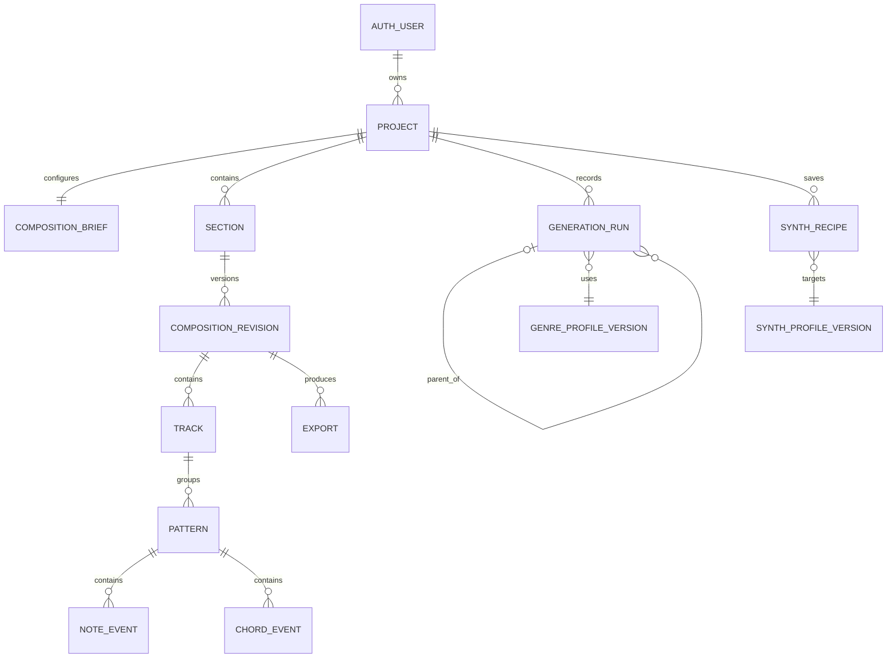

# Data model

## Goals

The model preserves ownership, canonical composition state, immutable generation lineage, versioning, and reproducibility without storing every concept as an isolated row. Supabase/PostgreSQL is planned but not provisioned in Stage 1.

## Entities and key constraints

| Entity | Purpose and representative fields | Constraints/indexes |
|---|---|---|
| `project` | `id`, `owner_id`, name, timestamps, current revision | owner FK; `(owner_id, updated_at)`; nonblank bounded name |
| `composition_brief` | project, genre/profile version, mood tags, BPM, key/scale, section, energy, complexity | one per project; bounded enums/ranges; version explicit |
| `section` | project, name/type, bar count, time signature, order | V1 requires 8 bars/4-4; unique order per project |
| `composition_revision` | immutable canonical snapshot/version, schema version, hash, source kind, author/time | unique `(project_id, version)` and canonical hash; current pointer updated transactionally |
| `track` | revision, stable role, name, MIDI channel policy, locked flag | unique role per V1 revision; role enum |
| `pattern` | track, position/length ticks, generator/run reference | positive range inside section |
| `note_event` | pattern, pitch, start/duration ticks, velocity | pitch/velocity MIDI bounds; duration > 0; indexed by pattern/start |
| `chord_event` | pattern, root/quality/inversion/voicing, start/duration | validated structured chord; ordered/no illegal overlap policy |
| `generation_run` | owner/project, parent, generator/version, engine version, profile version, seed, params, status, hashes, timestamps | immutable after completion except status transition; idempotency key unique per owner; parent same project |
| `genre_profile_version` | stable key/version, status, schema-valid parameters | immutable published versions; unique key/version |
| `synth_profile_version` | synth/version, vocabulary/capabilities | immutable published versions |
| `synth_recipe` | owner/project, synth profile version, role, structured settings, explanation revision | ownership; schema validation |
| `export` | owner/project/revision, format/version, status, manifest/hash, expiry | indexed owner/time; immutable result metadata |

JSON may hold versioned generator parameters, profile definitions, and frozen canonical snapshots where atomic relational querying provides little value. Core ownership, lineage, status, identity, and queryable event data remain relational. Do not duplicate authoritative values across JSON and columns without a documented synchronization rule.

## Ownership and RLS

- `auth.users.id` is the identity root; domain tables store `owner_id` where it makes policy obvious even when derivable.
- `SELECT/INSERT/UPDATE/DELETE` requires `auth.uid() = owner_id`, plus parent ownership checks.
- Public read applies only to explicitly published, system-managed genre/synth profile versions.
- Service-role access is server-only and narrowly wrapped; ordinary app flows use user-scoped access.
- RLS tests cover direct-table requests, nested ownership, guessed UUIDs, deleted users, and public-profile immutability.

## Transactions, deletion, retention

- Saving a revision and advancing `project.current_revision_id` is atomic.
- A completed generation is immutable; retry creates or resolves the same idempotent result.
- Project deletion cascades user-owned sections/revisions/tracks/patterns/events/recipes/exports/generations after confirmation. Shared versioned profiles are restricted, not cascaded.
- Account deletion policy and recovery window require product/legal confirmation before implementation. Export binary retention should be short and configurable; metadata may follow project lifetime.
- Audit/security logs are separate from user content and follow a documented retention schedule.

## Migration strategy

Use reviewed SQL migrations, forward-compatible additive changes first, schema-version canonical payloads, deterministic migration fixtures, and rollback/repair plans. Production migrations never depend on client code having already upgraded.
