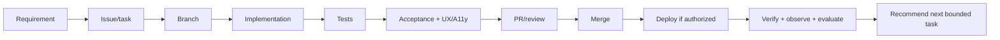

# Development workflow

## Bounded delivery loop

1. Confirm the authorized roadmap stage, requirement IDs, acceptance criteria, non-goals, and dependencies.
2. Inspect repository/status/branch/remotes and preserve unrelated work.
3. Create a focused issue/task and branch. Record assumptions or blocking decisions.
4. Make the smallest coherent change with documentation and tests.
5. Run proportionate local/CI validation; do not weaken gates.
6. Verify acceptance, failure states, UX, accessibility, security, data, and deployment impact.
7. Open a reviewable PR with evidence; merge/deploy only when expressly authorized by task/workflow.
8. Verify the resulting environment and observability when deployment is in scope.
9. Report and stop. A recommendation is not permission to start another milestone.

## Branches, commits, and reviews

Use descriptive branches such as `stage-3/music-time-primitives`. Keep commits logical and messages outcome-focused. Avoid mixed refactors. The default branch must remain deployable once an application exists. PRs state scope, requirements, decisions, test evidence, UX/accessibility evidence, security/data/deployment impacts, risks, rollback, and screenshots/artifacts when relevant.

## Definition of done

The bounded requirement is implemented; acceptance evidence is recorded; relevant tests and build pass; documentation/ADRs/contracts/migrations are current; errors and observability are addressed; no secret or unrelated change exists; and the delivery report is complete. Human-only verification is clearly identified rather than guessed.

## Dependency admission record

Before adding a significant dependency, record its exact purpose and why platform/standard-library code is insufficient; license; release/maintenance health; known security posture; browser bundle or runtime cost; operational and monetary cost; supported runtimes; portability/lock-in; data/privacy impact; and removal/migration path. Pin through the selected package manager and commit its lockfile. Reject dependencies that add speculative microservices, queues, orchestration, vectors, or model infrastructure without an approved requirement.

## Required task report

Report: task completed; files modified; implementation summary; tests/results; acceptance verification; UX/accessibility verification; architecture/docs, Supabase, and deployment changes; branch; commit; push; assumptions; remaining risks/debt; recommended next smallest backlog task. Do not implement that recommendation automatically.
