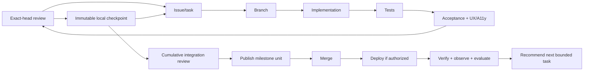

# Development workflow

## Bounded delivery loop

```mermaid
flowchart LR
  R[Requirement] --> I[Issue/task]
  I --> B[Branch]
  B --> C[Implementation]
  C --> T[Tests]
  T --> A[Acceptance + UX/A11y]
  A --> R[Exact-head review] --> L[Immutable local checkpoint]
  L --> I
  L --> F[Cumulative integration review] --> P[Publish milestone unit]
  P --> M[Merge]
  M --> D[Deploy if authorized]
  D --> V[Verify + observe + evaluate]
  V --> N[Recommend next bounded task]
```

1. Confirm repository eligibility for the bounded roadmap task, requirement IDs, acceptance criteria, non-goals, and dependencies.
2. Inspect repository/status/branch/remotes and preserve unrelated work.
3. Codex selects one repository-eligible bounded task, prepares its compact task packet, and creates a focused branch when needed. Record assumptions or blocking decisions.
4. Make the smallest coherent change with documentation and tests.
5. Run proportionate local/CI validation; do not weaken gates.
6. Verify acceptance, failure states, UX, accessibility, security, data, and deployment impact.
7. After task review and required local checks pass, preserve the immutable local checkpoint under [ADR-031](DECISIONS.md#adr-031--local-reviewed-checkpoints-and-milestone-level-integration). Continue only to a separately eligible bounded task. At the recorded integration boundary, freeze and independently review the complete cumulative candidate against the actual target base, then publish only when the threshold below and all required acceptance gates hold. Merge only when that reviewed tuple, current-base assessment, required checks and protections pass. Deployment retains its separate policy.
8. Verify the resulting environment and observability when deployment is in scope.
9. Report the completed bounded task. During the active execution session, Codex may select the next separately bounded task when repository truth already makes it eligible and no task-specific stop boundary applies; a recommendation alone never establishes eligibility for another milestone or capability.

## GitHub publication threshold

Git is the engineering history; GitHub is the publication and integration boundary, not the task-by-task coordination system. Subject to ADR-031's protected activation lifecycle, milestone-level integration is the default for prospective ordinary product work. Record the intended integration boundary in existing task/state evidence. Preserve one bounded task at a time, its required validation and independent review, while accumulating immutable reviewed local checkpoints. A completed task, command, specification, review or bookkeeping update does not automatically require a PR. Do not push unreviewed/intermediate corrections for visibility.

Use a meaningful bounded sub-milestone or earlier integration when a coherent independently eligible capability warrants it, accumulated scope/coupling makes waiting materially risky, required remote CI or another accepted gate is needed before continuation, or explicit Product Owner direction requires it. Record the concrete reason; do not relabel every micro-task as a sub-milestone. If a smaller boundary needs consequential judgment, use the existing bounded assessment/decision route. Publication batching never enlarges product scope or waives prerequisites.

At that boundary, publish the independently reviewed complete integration unit: application/runtime source and substantive tests, necessary governing contracts and mechanically related coordination. Governance/reviewer/security-policy changes, qualification/evidence authority and freezes, deployment/release, and explicitly integration-gated work keep their existing protected lifecycle. They cannot use an automatic local-acceptance shortcut. Required final consequential review and exact-tuple Product Owner acceptance are preserved when the integration candidate contains new consequential authority. Classify the complete cumulative PR diff for CI, not its final commit.

Do not create a GitHub PR for task or review packets, local investigations, unreviewed intermediate corrections, immaterial branch refreshes, or coordination bookkeeping that only records a PR number, merge SHA, already-binding fact, or replaces an awaiting-review sentence. Keep PROJECT_STATE materially accurate locally, distinguishing integrated state and pending local batch work. Include necessary related coordination changes before final integration review; adding them after PASS creates a new unreviewed candidate. Prefer wording truthful before and after merge; Git/review evidence establishes actual integration, not a predicted containing SHA. A genuinely misleading integrated gate permits an immediate separately reviewed correction. Session completion alone does not force publication or authorize automatic backup pushes.

## Branches, commits, and reviews

Use descriptive branches such as `stage-3/music-time-primitives`. Keep commits logical and messages outcome-focused. Avoid mixed refactors. The default branch must remain deployable once an application exists. PRs state scope, requirements, decisions, test evidence, UX/accessibility evidence, security/data/deployment impacts, risks, rollback, and screenshots/artifacts when relevant.

## Definition of done

Distinguish local completion from integration. A reviewed local checkpoint satisfies its bounded requirement, required local validation and review, accepted contract, documentation, error/non-goal checks and delivery evidence; required remote evidence remains explicitly pending. A failed or unavailable required local check or unresolved blocking finding prevents calling the task complete. The integration unit additionally requires complete cumulative review/acceptance, actual protected PR CI/evidence, accepted merge and ancestry verification. Neither status establishes milestone acceptance, qualification, deployment or release by itself. Human-only verification is identified rather than guessed.

## Dependency admission record

Before adding a significant dependency, record its exact purpose and why platform/standard-library code is insufficient; license; release/maintenance health; known security posture; browser bundle or runtime cost; operational and monetary cost; supported runtimes; portability/lock-in; data/privacy impact; and removal/migration path. Pin through the selected package manager and commit its lockfile. Reject dependencies that add speculative microservices, queues, orchestration, vectors, or model infrastructure without an approved requirement.

The authoritative current register is [Dependencies](DEPENDENCIES.md). Dependency changes require `npm install` with the selected Node/npm versions, review of lockfile and install scripts, `npm ls`, `npm audit`, the full validation command, and an updated register in the same change. Clean reproducibility is verified with `npm ci`; do not hand-edit `package-lock.json`.

## Required task report

Report: task completed; files modified; implementation summary; tests/results; acceptance verification; UX/accessibility verification; architecture/docs, Supabase, and deployment changes; branch; commit; push; assumptions; remaining risks/debt; recommended next smallest backlog task. Implement a subsequent bounded task only when repository truth independently establishes its eligibility.
