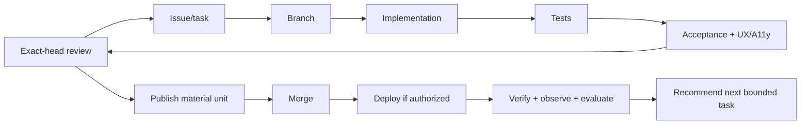

# Development workflow

## Bounded delivery loop

```mermaid
flowchart LR
  R[Requirement] --> I[Issue/task]
  I --> B[Branch]
  B --> C[Implementation]
  C --> T[Tests]
  T --> A[Acceptance + UX/A11y]
  A --> R[Exact-head review] --> P[Publish material unit]
  P --> M[Merge]
  M --> D[Deploy if authorized]
  D --> V[Verify + observe + evaluate]
  V --> N[Recommend next bounded task]
```

1. Confirm repository eligibility for the bounded roadmap task, requirement IDs, acceptance criteria, non-goals, and dependencies.
2. Inspect repository/status/branch/remotes and preserve unrelated work.
3. Codex selects one repository-eligible bounded task, prepares its compact task packet, and creates a focused branch when needed. Record assumptions or blocking decisions.
4. Make the smallest coherent change with documentation and tests.
5. Run proportionate local/CI validation; do not weaken gates.
6. Verify acceptance, failure states, UX, accessibility, security, data, and deployment impact.
7. After exact-head review passes, publish only when the bounded change meets the publication threshold below; merge through the accepted Git workflow only when the reviewed tuple remains valid, the current-base assessment passes, and required checks and protections pass. A review PASS alone does not require publication. Deployment remains subject to its own accepted policy and any unresolved consequential decision.
8. Verify the resulting environment and observability when deployment is in scope.
9. Report the completed bounded task. During the active execution session, Codex may select the next separately bounded task when repository truth already makes it eligible and no task-specific stop boundary applies; a recommendation alone never establishes eligibility for another milestone or capability.

## GitHub publication threshold

Git is the engineering history; GitHub is the publication and integration boundary, not the task-by-task coordination system. Keep routine work local until one final exact-head candidate is ready. Do not push intermediate implementation or corrective commits for visibility. A correction after REVISE stays local until it is the next final candidate and has its required renewed review.

Publish materially useful integration units: application/runtime source; substantive tests; qualification or acceptance evidence needed for a binding gate; governing product, architecture, contract, roadmap, or scope changes; dependencies, lockfiles, runtime or CI configuration; security, release, or deployment policy; and coordination changes that materially change the actual current gate.

Do not create a GitHub PR for task or review packets, local investigations, unreviewed intermediate corrections, immaterial branch refreshes, or coordination bookkeeping that only records a PR number, merge SHA, already-binding fact, or other history. Do not publish repeated `PROJECT_STATE.md` edits unless leaving the current milestone, gate, blocker, or next eligible task unchanged would materially mislead. Defer useful but nonurgent coordination edits to a later substantive change only when doing so does not mix scopes or weaken exact-head review.

## Branches, commits, and reviews

Use descriptive branches such as `stage-3/music-time-primitives`. Keep commits logical and messages outcome-focused. Avoid mixed refactors. The default branch must remain deployable once an application exists. PRs state scope, requirements, decisions, test evidence, UX/accessibility evidence, security/data/deployment impacts, risks, rollback, and screenshots/artifacts when relevant.

## Definition of done

The bounded requirement is implemented; acceptance evidence is recorded; relevant tests and build pass; documentation/ADRs/contracts/migrations are current; errors and observability are addressed; no secret or unrelated change exists; and the delivery report is complete. Human-only verification is clearly identified rather than guessed.

## Dependency admission record

Before adding a significant dependency, record its exact purpose and why platform/standard-library code is insufficient; license; release/maintenance health; known security posture; browser bundle or runtime cost; operational and monetary cost; supported runtimes; portability/lock-in; data/privacy impact; and removal/migration path. Pin through the selected package manager and commit its lockfile. Reject dependencies that add speculative microservices, queues, orchestration, vectors, or model infrastructure without an approved requirement.

The authoritative current register is [Dependencies](DEPENDENCIES.md). Dependency changes require `npm install` with the selected Node/npm versions, review of lockfile and install scripts, `npm ls`, `npm audit`, the full validation command, and an updated register in the same change. Clean reproducibility is verified with `npm ci`; do not hand-edit `package-lock.json`.

## Required task report

Report: task completed; files modified; implementation summary; tests/results; acceptance verification; UX/accessibility verification; architecture/docs, Supabase, and deployment changes; branch; commit; push; assumptions; remaining risks/debt; recommended next smallest backlog task. Implement a subsequent bounded task only when repository truth independently establishes its eligibility.
