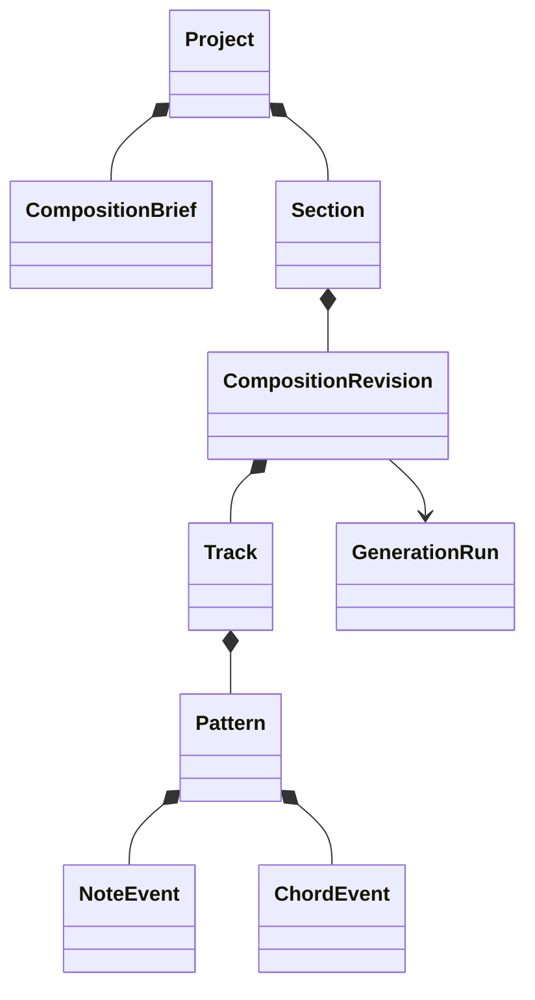

# Music domain model

## Primitive types

- `PitchClass`: implemented in Stage 3B1 as a strictly constructed integer semitone class `0..11`. It is chromatic identity only; enharmonic spelling is a later projection.
- `MidiPitch`: implemented in Stage 3B1 as a strictly constructed integer MIDI note number `0..127`. Its pitch class is exactly the note number modulo 12. Display `Note`, optional spelling, and octave convention remain deferred.
- `Interval`: Stage 3B2a implements only a strictly constructed signed safe-integer semitone distance. Named/diatonic metadata remains deferred until theory semantics require it.
- `Scale`: Stage 3B2b1 closed six-type identity with immutable seven-offset formula and numeric tonic-relative projection.
- `Key`: Stage 3B2b2a immutable numeric tonic `PitchClass` plus canonical `ScaleType`; projection delegates to the scale primitive and carries no spelling or key-signature data.
- `ChordQuality`: supported interval formula and stable key/version.
- `Chord`: root, quality, optional extensions permitted by profile, and pitch-class membership.
- `ChordInversion`: bass-member index.
- `ChordVoicing`: ordered absolute MIDI pitches plus range/spacing metadata.
- `TimeSignature`, `Tempo`, `MusicalPosition`, `Tick`, and `DurationTicks`: implemented in Stage 3A and defined in [Musical time](MUSICAL_TIME_MODEL.md).

Initial scales are Major, Natural Minor, Harmonic Minor, Melodic Minor, Dorian, and Phrygian. Scale degrees are zero-based `0..6`; note spelling and key-signature semantics remain deferred.

## Composition hierarchy

`Project` is the ownership/workspace aggregate. `CompositionBrief` captures intent. `Section` defines musical bounds. An immutable `CompositionRevision` contains role-based `Track`s and their `Pattern`s/events. Generation runs describe provenance rather than becoming musical truth themselves.

## Events and invariants

`NoteEvent` has stable ID, pitch, start tick, duration ticks, velocity, optional channel/articulation metadata, and provenance. `ChordEvent` has stable ID, chord symbol/structure, voicing, start/duration ticks, and provenance. Event arrays have deterministic canonical ordering.

Validate domain ranges, section containment, role compatibility, supported scale/chord formulas, strictly ascending unique voicing pitches where applicable, voice/range limits, and explicit exceptions. Display spelling, UI selection, synth assignment, preview nodes, and MIDI byte offsets are projections—not canonical theory.

## Canonical serialization

Stage 3B2b2a adds `nightdrive.key.v1` with `tonicSemitoneClass` and `scale`, without derived arrays or spelling.

Use a versioned schema, normalized enum strings, explicit units, ordered keys/arrays under a specified canonicalizer, and no derived duplicates. Stage 3A fixes deterministic JSON forms for time primitives. Stage 3B1 adds `nightdrive.pitch-class.v1` with `semitoneClass` and `nightdrive.midi-pitch.v1` with `midiNoteNumber`; neither includes spelling or octave labels. Stage 3B2a adds `nightdrive.interval.v1` with signed `semitones` only. Stage 3B2b1 adds `nightdrive.scale.v1` with canonical scale identity and ordered `semitones` only. Composition canonicalization and hashing remain a later, separately authorized Stage 3 deliverable.
