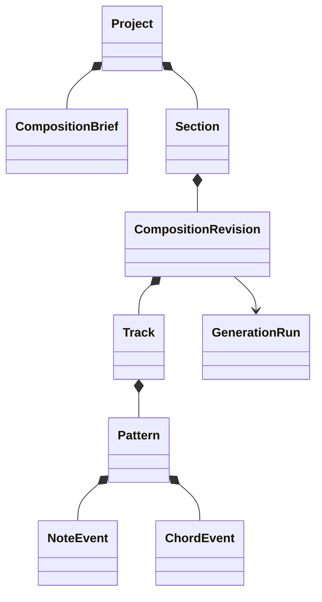

# Music domain model

## Primitive types

- `PitchClass`: implemented in Stage 3B1 as a strictly constructed integer semitone class `0..11`. It is chromatic identity only; enharmonic spelling is a later projection.
- `MidiPitch`: implemented in Stage 3B1 as a strictly constructed integer MIDI note number `0..127`. Its pitch class is exactly the note number modulo 12. Display `Note`, optional spelling, and octave convention remain deferred.
- `Interval`: Stage 3B2a implements only a strictly constructed signed safe-integer semitone distance. Named/diatonic metadata remains deferred until theory semantics require it.
- `Scale`: Stage 3B2b1 closed six-type identity with immutable seven-offset formula and numeric tonic-relative projection.
- `Key`: Stage 3B2b2a immutable numeric tonic `PitchClass` plus canonical `ScaleType`; projection delegates to the scale primitive and carries no spelling or key-signature data.
- `ChordQuality`: Stage 3B2b2c implements the closed triad-quality vocabulary with stable ID and immutable tonic-relative chromatic membership formula. The vocabulary/formula contract is versioned at the schema level; individual values carry no redundant version field.
- `Chord`: Stage 3B2b2e implements immutable triad-only root `PitchClass` plus `ChordQuality`; pitch-class membership is derived modulo 12. Extensions are outside `ChordQuality` and remain undefined until a later implementation slice.
- `ChordInversion`: bass-member index.
- `ChordVoicing`: ordered absolute MIDI pitches plus range/spacing metadata.
- `TimeSignature`, `Tempo`, `MusicalPosition`, `Tick`, and `DurationTicks`: implemented in Stage 3A and defined in [Musical time](MUSICAL_TIME_MODEL.md).

Initial scales are Major, Natural Minor, Harmonic Minor, Melodic Minor, Dorian, and Phrygian. Scale degrees are zero-based `0..6`; note spelling and key-signature semantics remain deferred.

## V1 ChordQuality contract (Stage 3B2b2b)

The contract was defined in Stage 3B2b2b and implemented in Stage 3B2b2c. The vocabulary and formulas are versioned as one canonical contract (conceptually `ChordQuality` contract version + stable quality ID → immutable formula). The version belongs to the vocabulary/schema contract and is not redundant per-instance derived state; serialization uses the versioned schema without a per-instance version field.

| Label | Stable ID | Tonic-relative semitone formula | Profile justification |
|---|---|---|---|
| Major triad | `major-triad` | `[0,4,7]` | Foundational harmonic center for Dark Synthwave, Classic Synthwave, Darkwave, and Midtempo Cyberpunk. |
| Minor triad | `minor-triad` | `[0,3,7]` | Foundational darker harmonic center for all four accepted profiles. |
| Diminished triad | `diminished-triad` | `[0,3,6]` | Compact leading-tone/tension color for harmonic-minor and darker chromatic contexts across the profiles. |

These formulas are immutable tonic-relative pitch-class membership sets only. Ordering, octave duplication, root, inversions, voicings, spelling, and extensions are outside `ChordQuality`. Suspended, augmented, seventh, altered, extended, borrowed, slash, and modal-interchange structures are deferred. Seventh structures will be future extension metadata on `Chord`, not standalone quality identities.

## V1 Chord aggregate contract (Stage 3B2b2d)

Stage 3B2b2d defined this contract; Stage 3B2b2e implemented it. Canonical `Chord` identity contains exactly `root: PitchClass` and `quality: ChordQuality` for the initial triad-only implementation. Extensions are not supported initially and will be a separately versioned field/contract only when authorized. Pitch-class membership is deterministic derived state: add each quality offset to the root modulo 12, without storing or serializing a duplicate member list. Formula order is canonical normalization order, not a voicing or inversion.

For the four accepted V1 profiles—Dark Synthwave, Classic Synthwave, Darkwave, and Midtempo Cyberpunk—this triad-only primitive is sufficient as the immediate next implementation because it establishes deterministic Chord identity and membership, not the full harmonic-language feature set. Root plus major, minor, and diminished triad quality is enough to validate that identity layer. Richer seventh/extension structures may be musically useful later but are not required to validate Chord itself; they remain future extension metadata owned by Chord under a separately accepted contract. Stage 4 harmony must not infer or implement extension support until that contract is authorized.

Root is numeric chromatic identity only; it contains no spelling, enharmonic preference, octave, MIDI pitch, or key-signature meaning. Two Chords are equal iff root, quality, and any future extension metadata are equal; contextual membership coincidence does not collapse distinct identities.

Serialization is implemented as `nightdrive.chord.v1` with the minimal triad representation `{"schema":"nightdrive.chord.v1","rootSemitoneClass":0,"quality":"major-triad"}`. It contains no derived membership, inversion, voicing, spelling, display, timing, or context fields. Future extension semantics require a later accepted contract/schema version.

`ChordInversion` will identify the bass member without changing Chord identity. `ChordVoicing` will realize ordered absolute MIDI pitches with range/spacing/doubling as appropriate without becoming Chord identity. The future harmony engine selects chords and owns progression, function, inversion, voicing, voice-leading, tension, and movement decisions; none are canonical Chord properties.

## V1 ChordInversion contract (Stage 3B2b2f)

Stage 3B2b2f defined this contract; Stage 3B2b2g implements its scalar `memberIndex` primitive. `ChordInversion` is separate contextual metadata identifying which canonical member of a triad occupies the bass role. Its identity is exactly a validated `memberIndex` in `0..2`: `0` root position, `1` first inversion, and `2` second inversion. The index follows the existing formula-derived chord-member order; it does not introduce spelling or a realized pitch arrangement. `ChordInversion` contains no chord, root, quality, pitch, MIDI, octave, voicing, range, spacing, doubling, harmony, or progression state. It does not mutate or alter canonical `Chord` identity and is not included in `nightdrive.chord.v1`.

The reserved serializer is `nightdrive.chord-inversion.v1` with conceptual shape `{"schema":"nightdrive.chord-inversion.v1","memberIndex":0}` and no redundant per-instance version or derived display label. Later implementation must reject non-finite, non-integer, out-of-range, unsafe, or malformed runtime values and revalidate forged values using existing primitive error conventions. If future extensions create four or more members, supported indices require an explicit versioned contract review. Realized MIDI placement and compatibility belong to a future `ChordVoicing`/harmony contract.

## Composition hierarchy

`Project` is the ownership/workspace aggregate. `CompositionBrief` captures intent. `Section` defines musical bounds. An immutable `CompositionRevision` contains role-based `Track`s and their `Pattern`s/events. Generation runs describe provenance rather than becoming musical truth themselves.

## Events and invariants

`NoteEvent` has stable ID, pitch, start tick, duration ticks, velocity, optional channel/articulation metadata, and provenance. `ChordEvent` has stable ID, chord symbol/structure, voicing, start/duration ticks, and provenance. Event arrays have deterministic canonical ordering.

Validate domain ranges, section containment, role compatibility, supported scale/chord formulas, strictly ascending unique voicing pitches where applicable, voice/range limits, and explicit exceptions. Display spelling, UI selection, synth assignment, preview nodes, and MIDI byte offsets are projections—not canonical theory.

## Canonical serialization

Stage 3B2b2a adds `nightdrive.key.v1` with `tonicSemitoneClass` and `scale`, without derived arrays or spelling.

Use a versioned schema, normalized enum strings, explicit units, ordered keys/arrays under a specified canonicalizer, and no derived duplicates. Stage 3A fixes deterministic JSON forms for time primitives. Stage 3B1 adds `nightdrive.pitch-class.v1` with `semitoneClass` and `nightdrive.midi-pitch.v1` with `midiNoteNumber`; neither includes spelling or octave labels. Stage 3B2a adds `nightdrive.interval.v1` with signed `semitones` only. Stage 3B2b1 adds `nightdrive.scale.v1` with canonical scale identity and ordered `semitones` only. Composition canonicalization and hashing remain a later, separately authorized Stage 3 deliverable.
