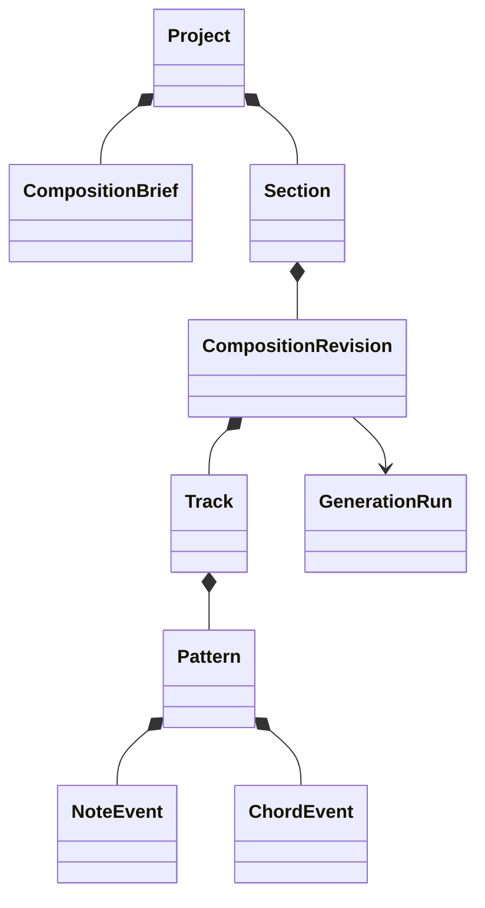

# Music domain model

## Primitive types

- `PitchClass`: one of 12 chromatic classes with an explicit spelling layer where needed.
- `MidiPitch`: integer 0–127; display `Note` combines pitch, optional spelling, and octave convention.
- `Interval`: signed semitone distance plus named/diatonic metadata when theory semantics require it.
- `Scale`: stable type/version and ordered pitch-class intervals from tonic.
- `Key`: tonic plus scale; enharmonic display policy is separate from pitch-class identity.
- `ChordQuality`: supported interval formula and stable key/version.
- `Chord`: root, quality, optional extensions permitted by profile, and pitch-class membership.
- `ChordInversion`: bass-member index.
- `ChordVoicing`: ordered absolute MIDI pitches plus range/spacing metadata.
- `TimeSignature`, `Tempo`, `MusicalPosition`, `Duration`: defined in [Musical time](MUSICAL_TIME_MODEL.md).

Initial scales are Major, Natural Minor, Harmonic Minor, Melodic Minor, Dorian, and Phrygian. Adding scales or chord vocabulary requires profile/use-case evidence and fixtures.

## Composition hierarchy

`Project` is the ownership/workspace aggregate. `CompositionBrief` captures intent. `Section` defines musical bounds. An immutable `CompositionRevision` contains role-based `Track`s and their `Pattern`s/events. Generation runs describe provenance rather than becoming musical truth themselves.

## Events and invariants

`NoteEvent` has stable ID, pitch, start tick, duration ticks, velocity, optional channel/articulation metadata, and provenance. `ChordEvent` has stable ID, chord symbol/structure, voicing, start/duration ticks, and provenance. Event arrays have deterministic canonical ordering.

Validate domain ranges, section containment, role compatibility, supported scale/chord formulas, strictly ascending unique voicing pitches where applicable, voice/range limits, and explicit exceptions. Display spelling, UI selection, synth assignment, preview nodes, and MIDI byte offsets are projections—not canonical theory.

## Canonical serialization

Use a versioned schema, normalized enum strings, explicit units, ordered keys/arrays under a specified canonicalizer, and no derived duplicates. Hash the canonical byte representation for determinism/locks/lineage. Exact schema is a Stage 3 deliverable.
