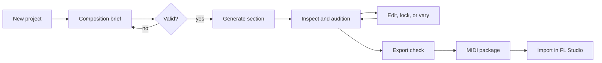

# User flows

## Primary create-to-export flow

1. The user creates a project or resumes one.
2. The brief starts with meaningful defaults and progressively reveals theory controls.
3. Auto-key returns a recommendation the user may override.
4. Generation produces visibly separate tracks and an inspectable generation record.
5. The user auditions all tracks or solos/mutes individual roles.
6. The user edits notes, undoes changes, locks satisfactory parts, and requests independent variations.
7. Explanations answer “why” using current structured state.
8. Export preflight reports invalid/missing data and offers a recoverable correction path.
9. The user downloads a standard MIDI package and imports it into FL Studio.

## Variation flow

Select a component → lock all components that must remain stable → choose a variation intent or bounded parameters → preview expected scope → generate with a new explicit seed → compare child to parent → keep either/both. Cancellation or failure leaves the parent untouched.

## Lightweight edit flow

Select track → select/add note → drag/resize/velocity/transpose with snap → hear preview → undo/redo → save a new composition revision. The editor exposes musical position and pitch, prevents zero/negative duration, and announces validation errors accessibly.

## Coach and recipe flow

The user requests advice → the system computes structured observations → the coach offers labeled subjective recommendations → the user chooses whether to apply a bounded transformation → deterministic generation/editing performs the change → the result retains lineage. Synth recipes show structured control targets plus explanatory text; unsupported synths receive generic signal-chain guidance rather than invented parameter names.

## Failure and recovery

- Invalid brief: preserve entries, identify exact fields, and focus the first error.
- Generation failure: preserve prior state; show request/generation ID and retry only when safe.
- AI timeout/schema failure: deterministic workflows remain usable; no partial canonical mutation.
- Audition unavailable: editing/export remain available with a clear degraded-state notice.
- Save conflict/offline: retain local unsaved changes, state synchronization status, and offer retry/reload comparison.
- Export validation failure: list affected tracks/events and never emit a misleading “successful” package.
- Unauthorized/not found: reveal no cross-user metadata; return to the project list.

## First-time and returning states

The empty state explains the 8-bar outcome and offers one primary “Create section” action. Returning users see project name, brief summary, last edited time, and current generation/revision. Destructive deletion is separated from common actions.
