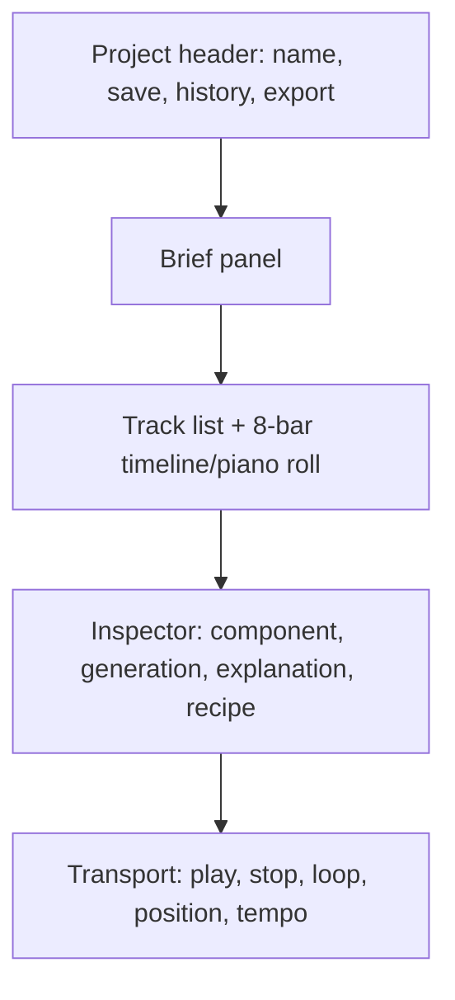

# UX design specification

## Experience model

Nightdrive is a compact workstation with four persistent concepts: **brief**, **tracks/timeline**, **inspector**, and **transport**. Conversation may assist intent or explanation but is never the primary canvas.

## Information hierarchy

- Header: project identity, persistence state, history, export.
- Brief: essential inputs first; advanced harmonic/movement settings disclosed on demand.
- Track list: role, color plus icon/label, mute/solo, lock, regenerate, status.
- Timeline: bars/beats, playhead, selection, notes, chord labels, zoom and snap.
- Inspector: selected musical item and bounded actions; explanations never obscure editing.
- Transport remains stable across modes.

## Interaction principles

- One clear primary action per state; defaults should yield a valid first result.
- Regeneration previews its scope and never alters locked tracks.
- Every cost-bearing/long-running action exposes progress, cancellation when feasible, and a stable ID.
- Empty, loading, success, stale, offline, partial, and error states are designed—not inferred from spinners.
- Preserve input after errors. Undo/redo applies to note edits; generated versions use history/lineage.
- Use direct labels such as “Regenerate bass,” not ambiguous magic language.

## Responsive behavior

- Desktop (primary): brief/sidebar, central timeline, and inspector may coexist.
- Narrow desktop/tablet: inspector becomes a drawer; track controls remain visible.
- Mobile: project overview, brief basics, audition, track inspection, locks, and history. Detailed piano-roll editing may be read-only with an explicit desktop notice.

## Keyboard and accessibility

- Logical DOM order follows header → brief → tracks/timeline → inspector → transport.
- All commands have button equivalents. Shortcuts are discoverable, remappable where conflicts matter, and suppressed in text inputs.
- Visible focus, skip/navigation landmarks, semantic labels, live regions for generation/save status, associated field errors, and no color-only meaning.
- Minimum status and timing diagrams require text alternatives. Minimum touch targets follow WCAG 2.2 guidance.
- Playback begins only after user action; provide volume, stop, and reduced/reduced-motion respect.

## Content and visual language

Use strong contrast and restrained genre atmosphere. Dark styling must not crush text, grid lines, selected notes, focus rings, or error states. Use plain music terminology with short contextual definitions for inversions, voicing width, gate, tension, and PPQ.

## Usability verification

Test the primary flow with first-time users using a prepared brief. Measure completion, critical errors, assistance required, time-on-task descriptively, and the question “Would you use or develop this material?” Accessibility verification combines automated checks with keyboard, zoom, screen-reader, and contrast/manual review. See [Evaluation](EVALUATION_PLAN.md).
